# MTR PS-OHLR DUAT - 每日更新分析工具

**版本**: 4.0.0 | **架構**: Electron + React SPA + FastAPI Sidecar

MTR 電力系統架空線更新（PS-OHLR）團隊的桌面分析工具。解析每日報告 DOCX 檔案，匯總項目交付數據，提供儀表板、滯後分析、績效追蹤、S-Curve、關鍵字搜尋及人力分析功能。

---

## 功能概覽

| 功能 | 說明 |
|------|------|
| DOCX 解析 | 自動掃描資料夾，解析每日報告中的藍色文字、項目代碼、鐵路線 |
| 儀表板 | 統計卡片 + 6 種圖表（每週/每月趨勢、專案/關鍵字/路線分佈） |
| 滯後分析 | 上傳 Project Master，計算 NTH Lag/Lead，5 級狀態分類 |
| 績效追蹤 | 每週/累計圖表、達成率、恢復路徑計算 |
| S-Curve | 目標 vs 實際累計曲線、Excel 匯出 |
| 關鍵字搜尋 | 在 DOCX 檔案中搜尋指定關鍵字 |
| 人力分析 | KPI、角色頻率、團隊分佈分析 |
| 國際化 | 中文 / English 即時切換 |
| 可攜式 | 打包為 .exe，無需安裝 Python 或 Node.js |

---

## 系統架構

### 四層架構總覽

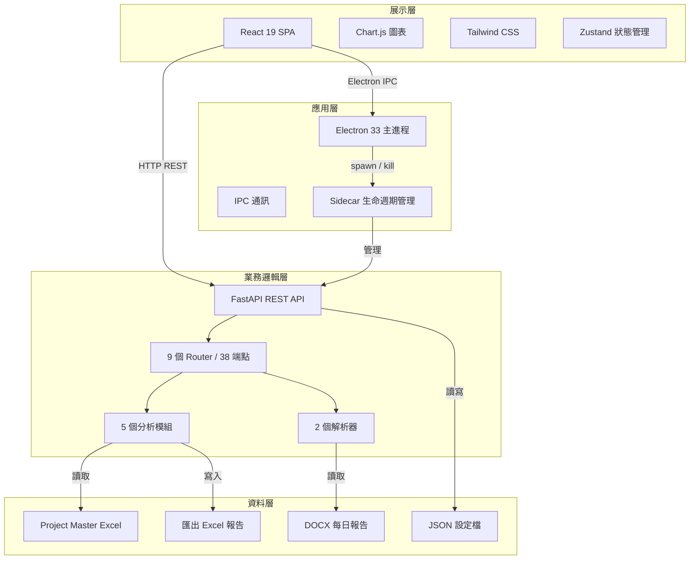

### Electron + Sidecar 啟動流程

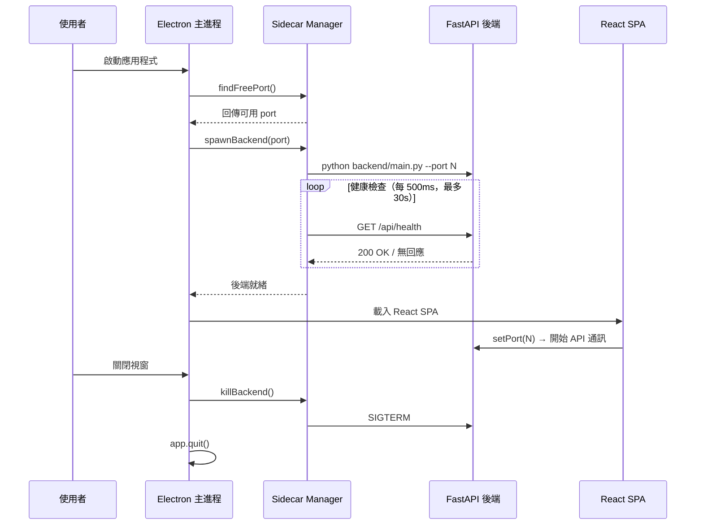

### IPC 通訊架構

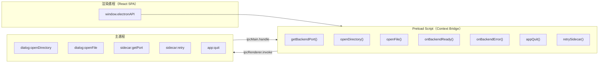

---

## 重建歷程

本專案從 Python Flet + FastAPI 單體架構，重建為 Electron + React + FastAPI 混合桌面應用。

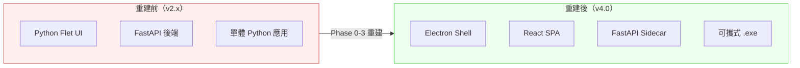

### 重建階段

| 階段 | 內容 | 關鍵變化 |
|------|------|----------|
| Phase 0 | 基礎建設 | 建立 Electron Shell、Sidecar Manager、Preload Script |
| Phase 1 | 後端完善 | 重新開發 docx_parser、manpower_parser、config、excel_export |
| Phase 2 | 前端開發 | 從零建立 React SPA（7 頁面 + Zustand + i18n） |
| Phase 3 | Electron 整合 | IPC 通訊、動態 port、視窗管理、HMR 開發模式 |
| Phase 4 | 打包與測試 | PyInstaller + electron-builder → 可攜式 .exe |

### 重建前後對比

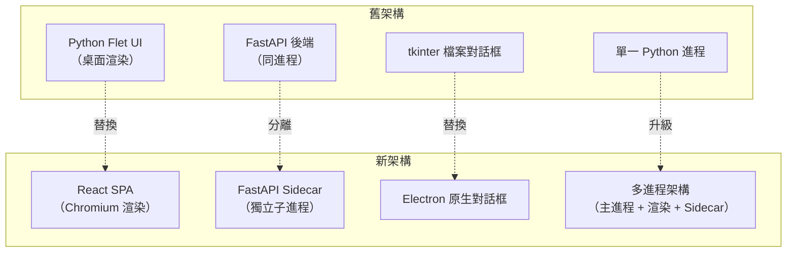

---

## 核心模組詳解

### 模組互動關係

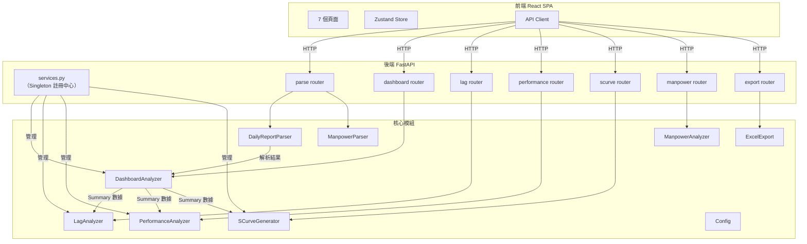

---

## 演算法邏輯

### 1. DOCX 藍色文字偵測

解析器掃描 DOCX 表格中的每個儲存格，透過 RGB 色值判斷是否為藍色文字，從而識別工作類型關鍵字。

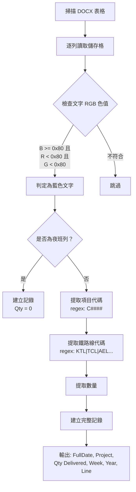

**檔名解析規則**：`PS-OHLR_DUAT_Daily Report_WK##_YYYY.docx` → 提取週數與年份

### 2. NTH Lag/Lead 滯後分析演算法

核心公式計算每個項目的進度偏差，並以 5 級狀態分類。

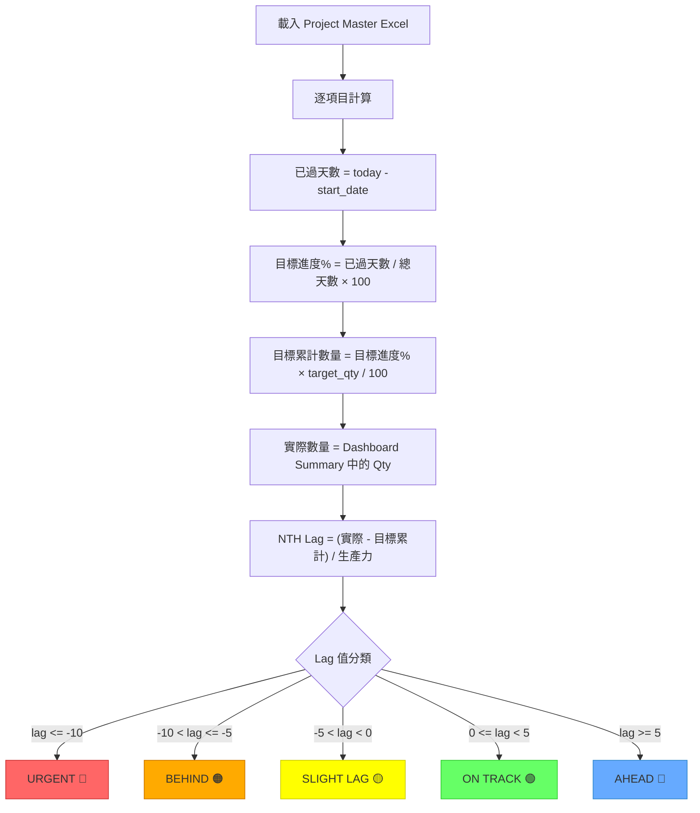

**公式摘要**：

```
elapsed_days    = (today - start_date).days
target_progress = (elapsed_days / total_days) × 100
target_qty_now  = target_progress × target_qty / 100
NTH_Lag_Lead    = (actual_qty - target_qty_now) / productivity
```

### 3. 績效追蹤演算法

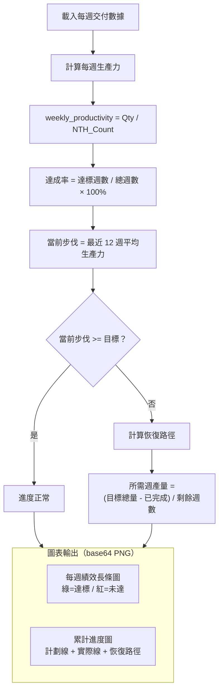

### 4. S-Curve 累計曲線演算法

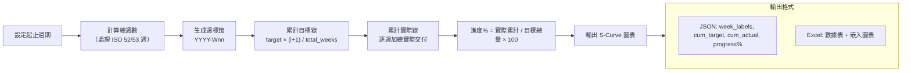

### 5. 人力分析演算法

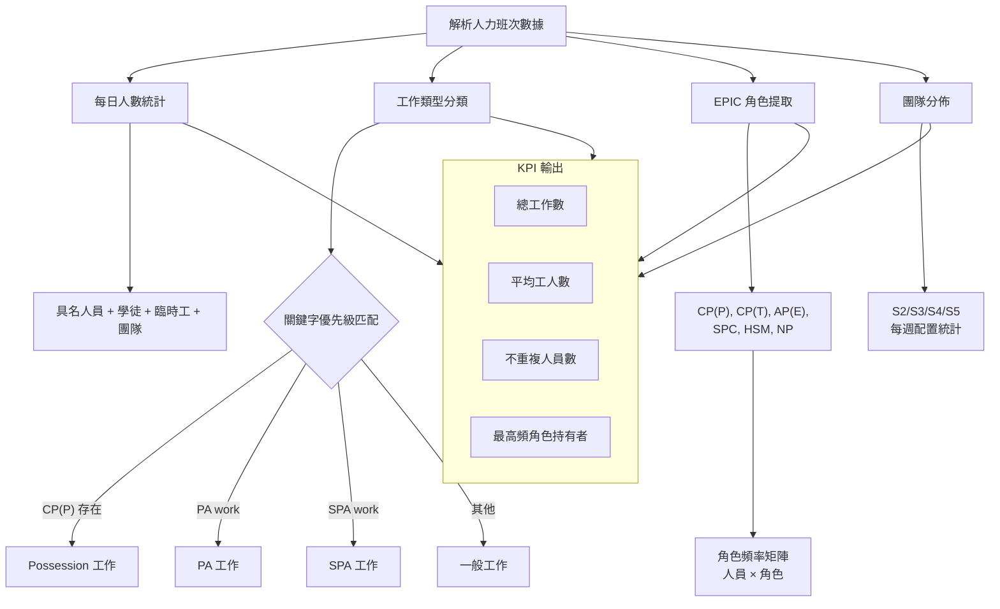

### 6. 儀表板分析流程

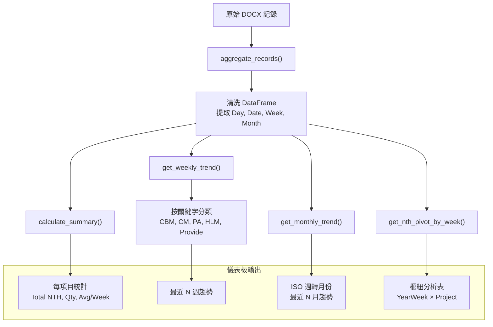

---

## 資料流程

### 完整資料處理管線

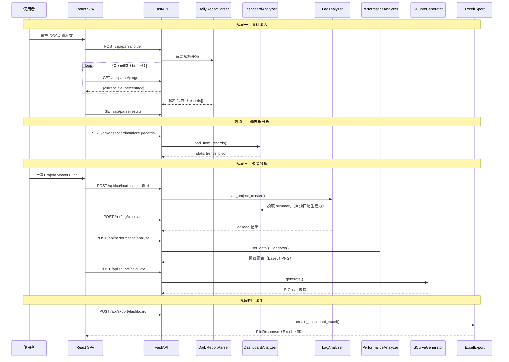

### 設定檔路徑策略

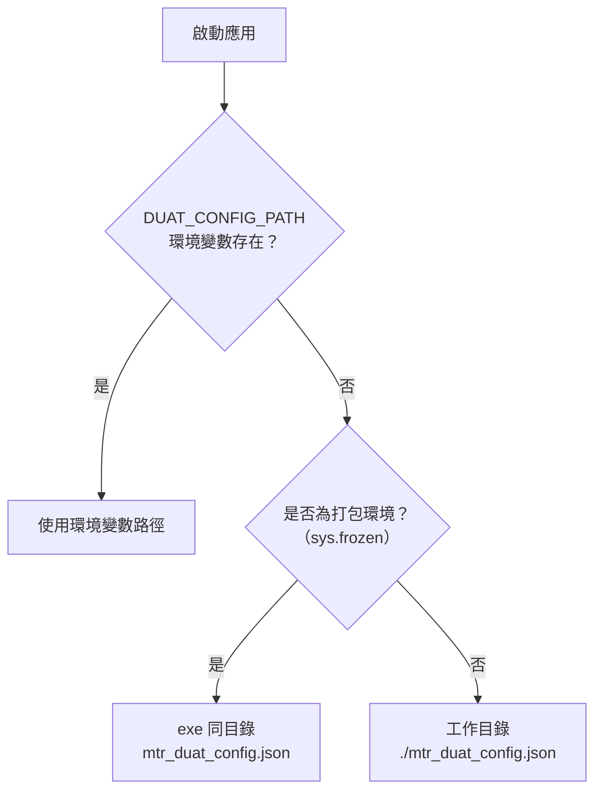

---

## 專案結構

```
├── electron/               # Electron 主進程
│   ├── main.js             # 視窗建立 + IPC Handler + Sidecar 啟動
│   ├── sidecar.js          # Sidecar Manager（port 分配、健康檢查、進程管理）
│   └── preload.js          # Context Bridge（安全暴露 API 給渲染進程）
├── frontend/               # React SPA（TypeScript + Vite + Tailwind）
│   └── src/
│       ├── components/     # 共用元件
│       │   ├── Layout.tsx          # 主佈局
│       │   ├── Sidebar.tsx         # 導航選單
│       │   ├── charts/            # BarChart, LineChart, PieChart, SCurveChart
│       │   └── tables/            # DataTable, PivotTable
│       ├── pages/          # 7 個頁面
│       │   ├── HomePage.tsx        # 資料夾選擇 + 解析
│       │   ├── DashboardPage.tsx   # 統計 + 6 種圖表
│       │   ├── LagAnalysisPage.tsx # Master 上傳 + 滯後結果
│       │   ├── PerformancePage.tsx # 每週 + 累計圖表
│       │   ├── KeywordSearchPage.tsx
│       │   └── ManpowerPage.tsx    # KPI + 角色分析
│       └── lib/            # 核心工具
│           ├── api.ts              # HTTP Client（動態 port）
│           ├── store.ts            # Zustand 全域狀態
│           ├── i18n.ts             # 中英文翻譯
│           └── types.ts            # TypeScript 介面定義
├── backend/                # FastAPI REST API
│   ├── main.py             # 入口 + CORS + 路由註冊 + --port 參數
│   ├── services.py         # Singleton 註冊中心（5 個分析器實例）
│   └── routers/            # 9 個 API Router
│       ├── config.py       # 設定 CRUD + 重置
│       ├── parse.py        # DOCX 解析 + 進度輪詢
│       ├── dashboard.py    # 統計 + 趨勢 + 分佈 + 樞紐分析
│       ├── lag.py          # Master 上傳 + Lag/Lead 計算
│       ├── performance.py  # 績效分析 + 圖表生成
│       ├── scurve.py       # S-Curve 計算 + Excel 匯出
│       ├── export.py       # Dashboard/Lag Excel 匯出
│       ├── keyword.py      # 全文搜尋
│       └── manpower.py     # 人力掃描 + 分析 + 匯出
├── analysis/               # 5 個分析模組
│   ├── dashboard.py        # DashboardAnalyzer（聚合、摘要、趨勢、樞紐）
│   ├── lag_analysis.py     # LagAnalyzer（Lag/Lead 計算、5 級分類）
│   ├── performance.py      # PerformanceAnalyzer（生產力、達成率、恢復路徑）
│   ├── scurve.py           # SCurveGenerator（累計曲線、ISO 週處理）
│   └── manpower.py         # ManpowerAnalyzer（KPI、角色、團隊、工作分類）
├── parsers/                # 解析器
│   ├── docx_parser.py      # DailyReportParser（藍色文字偵測、記錄提取）
│   └── manpower_parser.py  # ManpowerParser（班次、角色、團隊解析）
├── config.py               # JSON 設定讀寫（可攜式路徑策略）
├── utils/
│   └── excel_export.py     # Excel 匯出工具（多表、自動欄寬）
├── tests/                  # pytest 測試（365+ tests, 92%+ 覆蓋率）
├── docs/                   # 技術文件
└── scripts/                # 建置腳本
```

---

## 技術棧

| 層級 | 技術 | 版本 |
|------|------|------|
| 展示層 | React + Tailwind CSS + Chart.js + Zustand | 19 / 4.x / 4.5 / 4.5 |
| 應用層 | Electron + electron-builder | 33 / 25 |
| 業務邏輯層 | FastAPI + Uvicorn + pandas + numpy + matplotlib | 3.0 / 2.2 / 1.26 / 3.9 |
| 解析層 | python-docx + openpyxl | 1.1 / 3.1 |
| 建置工具 | Vite + PyInstaller + electron-builder | 7 / 6 / 25 |

---

## API 端點（38 個）

| 路由 | 端點數 | 說明 |
|------|--------|------|
| `/api/health` | 2 | 健康檢查 |
| `/api/config` | 4 | 設定管理（CRUD + 重置） |
| `/api/parse` | 5 | DOCX 解析（啟動、進度、結果、取消） |
| `/api/dashboard` | 12 | 儀表板（統計、趨勢、分佈、樞紐、原始數據） |
| `/api/lag` | 6 | 滯後分析（Master 上傳、計算、結果、狀態圖例） |
| `/api/performance` | 8 | 績效（每週分析、累計圖表、恢復路徑） |
| `/api/scurve` | 4 | S-Curve（計算、圖表、Excel 匯出） |
| `/api/export` | 4 | Excel 匯出（儀表板、滯後報告、檔案下載） |
| `/api/keyword` | 1 | 關鍵字全文搜尋 |
| `/api/manpower` | 3 | 人力分析（掃描、KPI、Excel 匯出） |

---

## 快速開始

### 前置需求

- Python 3.12+
- Node.js 20.x LTS
- Git

### 安裝

```bash
git clone https://github.com/A5Gold/DUAT-Project-Managment.git
cd DUAT-Project-Managment

# Python 環境
python -m venv .venv
.venv\Scripts\activate
pip install -r requirements.txt
pip install -r requirements-dev.txt

# Node 依賴
npm install
cd frontend && npm install && cd ..
```

### 開發模式

```bash
# 方式 A：完整開發（三個終端機，支援 HMR）
python backend/main.py --port 8000     # 終端機 1
cd frontend && npm run dev             # 終端機 2
set DUAT_ENV=development&& electron .  # 終端機 3

# 方式 B：簡易模式（單一終端機，使用已構建前端）
cd frontend && npx vite build && cd ..
npm run dev
```

---

## 指令參考

| 指令 | 說明 |
|------|------|
| `npm run dev` | 啟動 Electron（開發模式） |
| `npm run dev:backend` | 啟動 FastAPI 後端（port 8000） |
| `npm run dev:frontend` | 啟動 Vite Dev Server（port 3000） |
| `npm run frontend:build` | 建置前端 |
| `npm run backend:build` | PyInstaller 打包後端 |
| `npm run electron:build` | electron-builder 打包 |
| `npm run build` | 前端建置 + Electron 打包 |
| `npm run build:all` | 前端 + 後端 + Electron 完整建置 |
| `npm run test:backend` | 後端測試 + 覆蓋率 |
| `npm run test:frontend` | 前端單元測試 |
| `npm run test:electron` | Electron 測試 |
| `npm run test:all` | 全部測試 |

---

## 測試

```bash
# 後端測試（365+ tests, 92%+ 覆蓋率）
pytest tests/ --cov --cov-report=term-missing

# 前端測試
cd frontend && npm run test

# 全部測試
npm run test:all
```

---

## 建置可攜式 .exe

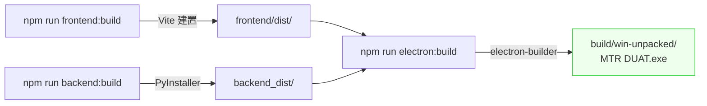

```bash
npm run frontend:build    # 1. 建置前端
npm run backend:build     # 2. PyInstaller 打包後端
npm run electron:build    # 3. Electron 打包
# 輸出：build/win-unpacked/MTR DUAT.exe
```

---

## 環境變數

| 變數 | 說明 | 開發預設值 | 生產值 |
|------|------|------------|--------|
| `DUAT_ENV` | 環境標識 | `development` | `production` |
| `DUAT_BACKEND_PORT` | 後端固定 port | `8000` | 動態分配 |
| `DUAT_LOG_LEVEL` | 日誌級別 | `DEBUG` | `WARNING` |
| `DUAT_CONFIG_PATH` | 設定檔路徑 | `./mtr_duat_config.json` | 與 .exe 同目錄 |

---

## 文件

| 文件 | 說明 |
|------|------|
| [architecture.md](docs/architecture.md) | 系統架構 + API 端點目錄 |
| [reconstruction-plan.md](docs/reconstruction-plan.md) | 完整重建計劃 |
| [prd.md](docs/prd.md) | 產品需求（13 Epic） |
| [todolist.md](docs/todolist.md) | 進度追蹤 + Bug 追蹤 |
| [dev-setup-guide.md](docs/dev-setup-guide.md) | 開發環境設置指南 |
| [e2e-test-plan.md](docs/e2e-test-plan.md) | E2E 測試計劃 |
| [uat-test-plan.md](docs/uat-test-plan.md) | UAT 驗收測試計劃 |

---

## 開發狀態

| 階段 | 狀態 | 進度 |
|------|------|------|
| Phase 0 基礎建設 | DONE | 100% |
| Phase 1 後端完善 | DONE | 100% |
| Phase 2 前端開發 | DONE | 100% |
| Phase 3 Electron 整合 | DONE | 100% |
| Phase 4 打包與測試 | IN PROGRESS | 60% |

---

## 授權

UNLICENSED - MTR 內部使用
