# 演算法邏輯文件

## MTR PS-OHLR DUAT - 每日更新分析工具

本文件描述程式碼中每個函式、元件和模組的演算法邏輯，並以 Mermaid 流程圖輔助說明。此文件對未來重建（Electron + Python + React + API + SQLite）至關重要。

---

## 1. 整體數據處理流程

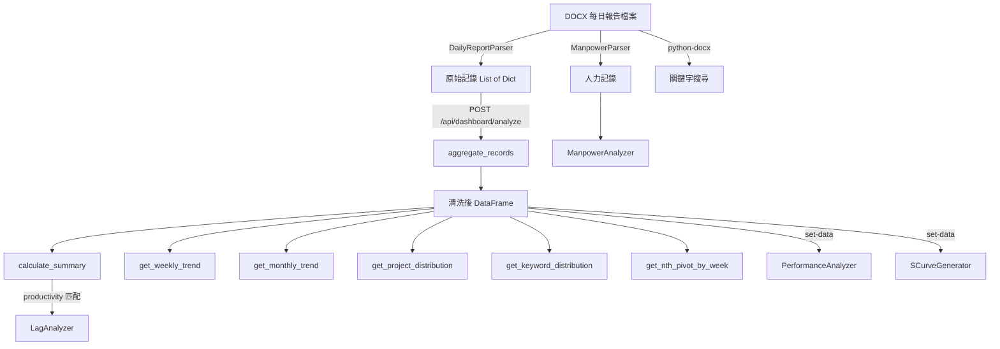

---

## 2. 分析模組 (`analysis/`)

### 2.1 儀表板分析 (`analysis/dashboard.py`)

#### `aggregate_records(records) -> DataFrame`

目的：將原始解析記錄轉換為清洗後的 DataFrame。

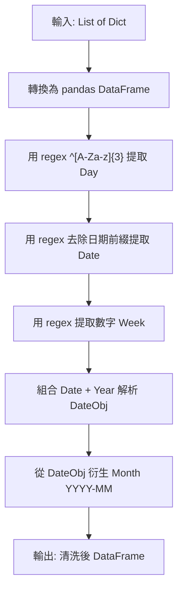

演算法步驟：
1. 將 list of dicts 轉為 pandas DataFrame
2. 用 regex `^([A-Za-z]{3})` 從 `FullDate` 提取 `Day`（三字母縮寫）
3. 用 regex 去除 `FullDate` 的日期前綴得到 `Date`
4. 用 regex `(\d+)` 從 Week 字串提取數字
5. 組合 `Date + '/' + Year` 以 `%d/%m/%Y` 格式解析為 `DateObj`
6. 從 `DateObj` 衍生 `Month`（`YYYY-MM` 格式）

輸入欄位：FullDate, Project, Qty Delivered, Week, Year
輸出新增欄位：Day, Date, DateObj, Month

---

#### `calculate_summary(df, current_week, current_month) -> DataFrame`

目的：按項目計算摘要統計。

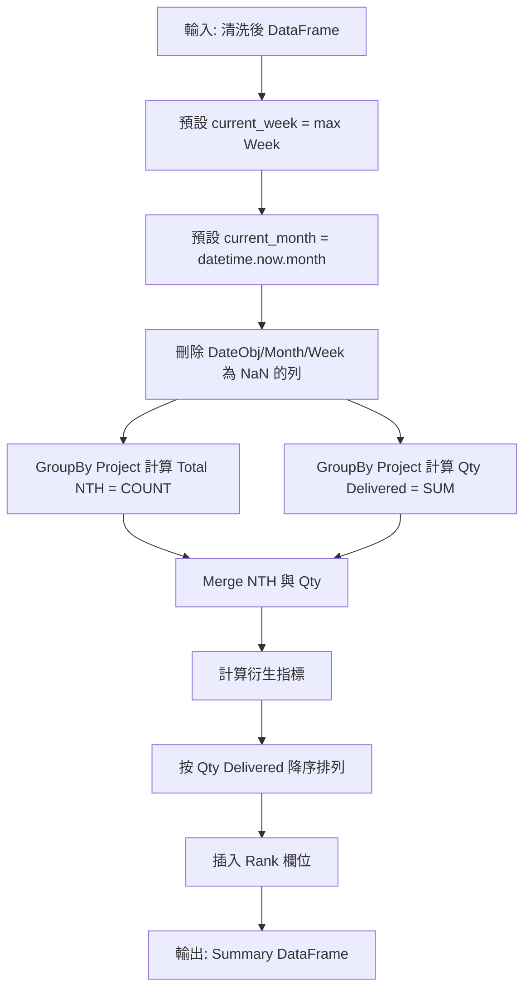

衍生指標公式：
- `Qty per NTH` = Qty Delivered / Total NTH
- `Avg Qty per Week` = Qty Delivered / current_week
- `Avg Qty per Month` = Qty Delivered / current_month
- `Avg NTH per Week` = Total NTH / current_week
- `Avg NTH per Month` = Total NTH / current_month

---

#### `get_weekly_trend(df, weeks=12) -> Tuple[List, Dict]`

目的：取得按 Projects vs Jobs 分類的每週 NTH 趨勢。

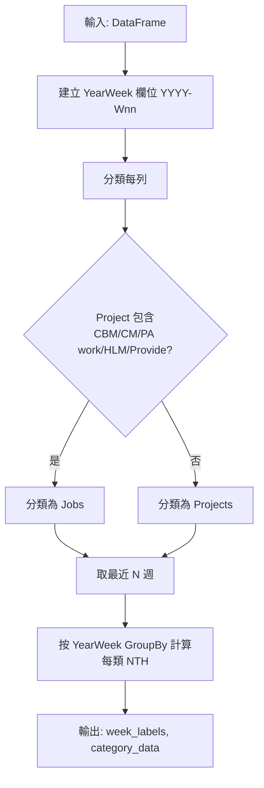

分類關鍵字（不區分大小寫）：`CBM`, `CM`, `PA work`, `HLM`, `Provide`

---

#### `get_monthly_trend(df, months=6) -> Tuple[List, List]`

目的：按月份匯總 NTH 趨勢。

演算法：
1. 將 Week 轉換為近似月份：`Month = ((Week - 1) // 4.33 + 1).clip(1, 12)`
2. 建立 `YearMonth`（`YYYY-MM`）
3. GroupBy YearMonth 計算 NTH 數量
4. 取最近 N 個月，按時間排序

---

#### `get_project_distribution(df) -> Dict[str, int]`

目的：按項目統計 NTH 分佈。

演算法：GroupBy Project 計算 size。將 `Provide` 重新命名為 `Provide manpower for switching`。

---

#### `get_keyword_distribution(df) -> Dict[str, int]`

目的：按工作關鍵字統計 NTH 分佈。

演算法：對每個關鍵字 `[CBM, CM, PA work, HLM, Provide]`，計算 Project 欄位包含該關鍵字的列數（不區分大小寫 `str.contains`）。

---

#### `get_nth_pivot_by_week(df) -> DataFrame`

目的：建立 NTH 樞紐分析表（週 x 項目）。

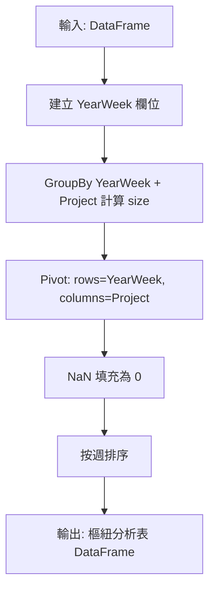

---

#### `class DashboardAnalyzer`

目的：高層儀表板數據管理器（在 router 中作為全域單例使用）。

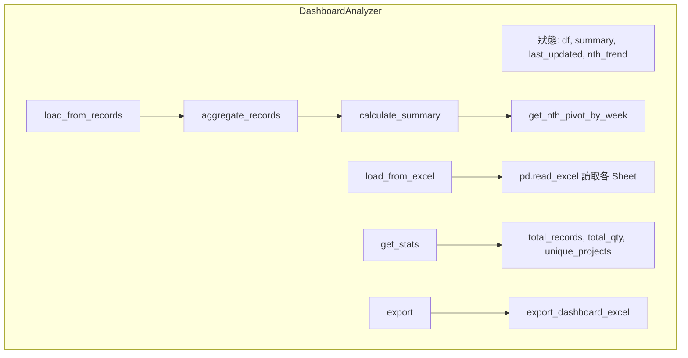

方法：
- `load_from_records(records, max_week)`: aggregate_records -> calculate_summary -> get_nth_pivot_by_week
- `load_from_excel(filepath)`: 讀取 Raw Data sheet，可選讀取 Summary 和 NTH Trend sheets
- `get_stats()`: 回傳 `{total_records, total_nth, total_qty, unique_projects, last_updated}`
- `export(output_path)`: 委派給 export_dashboard_excel

---

### 2.2 滯後/超前分析 (`analysis/lag_analysis.py`)

#### `get_status(nth_lag_lead) -> Tuple[str, str]`

目的：根據 NTH lag/lead 值分類項目狀態。

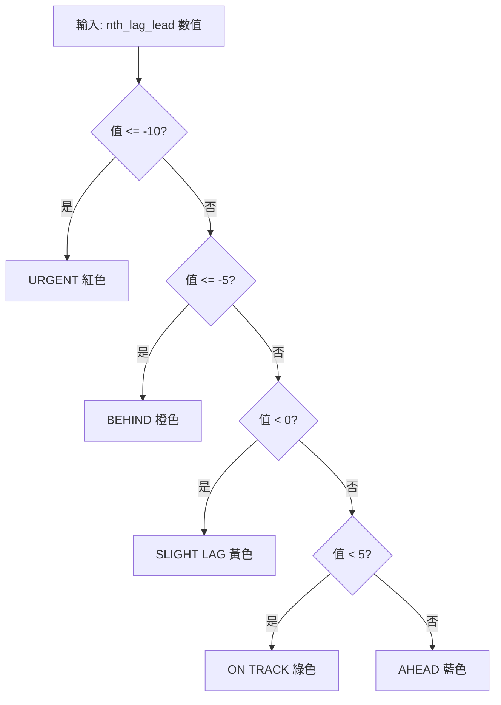

閾值表：

| NTH Lag/Lead | 狀態 | 顏色 | 嚴重程度 |
|-------------|------|------|----------|
| <= -10 | URGENT | red | 危急 |
| <= -5 | BEHIND | orange | 高 |
| < 0 | SLIGHT LAG | yellow | 中 |
| < 5 | ON TRACK | green | 正常 |
| >= 5 | AHEAD | blue | 正面 |

---

#### `load_project_master(filepath) -> Tuple[DataFrame, Dict, Dict]`

目的：載入並解析 Project Master Excel 檔案。

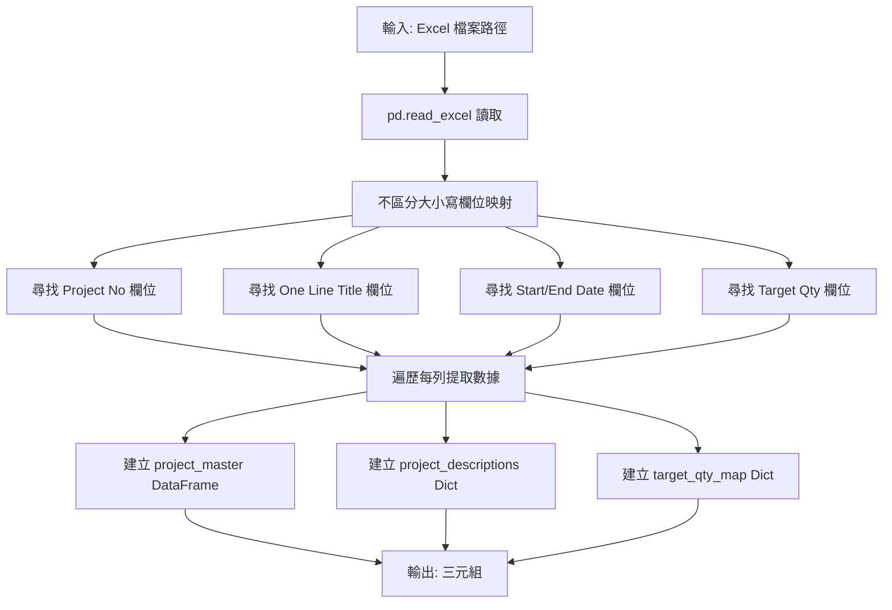

欄位映射優先順序（不區分大小寫）：
- Project No: `project no` > `projectno` > `project number` > Column C (fallback)
- Description: `one line title`（最高優先） > `description` > `title` > `project title`
- Start Date: `start date` > `startdate`
- End Date: `finish date` > `end date` > `finishdate`
- Target Qty: `target quantity` > `target qty`

---

#### `calculate_nth_lag_lead(project_master, config, actual_qty_map) -> List[Dict]`

目的：使用線性插值計算所有項目的 NTH 滯後/超前。

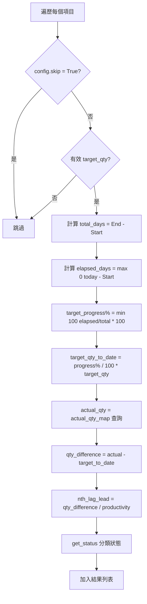

核心公式：
```
target_progress% = min(100, (today - start_date).days / (end_date - start_date).days * 100)
target_to_date = target_progress% / 100 * target_qty
nth_lag_lead = (actual_qty - target_to_date) / productivity
```

其中 `productivity` 預設為 3.0（Qty per NTH），可從儀表板 summary 自動匹配或由使用者手動輸入。

---

#### `class LagAnalyzer`

目的：高層滯後分析管理器。

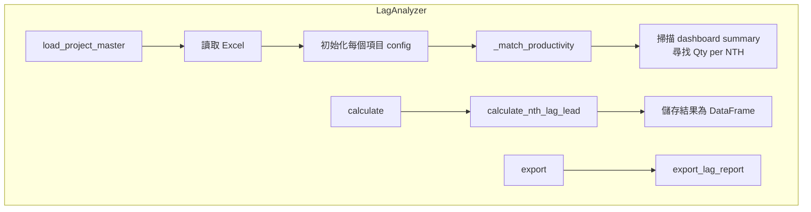

Productivity 來源優先順序：
1. `user_input` — 使用者手動輸入
2. `daily_report` — 從 dashboard summary 的 `Qty per NTH` 自動匹配
3. `default` — 預設值 3.0

---

### 2.3 S-Curve 生成 (`analysis/scurve.py`)

#### `calculate_scurve_data(df, project_code, target_qty, start_year, start_week, end_year, end_week)`

目的：計算特定項目的累計計劃 vs 實際進度數據。

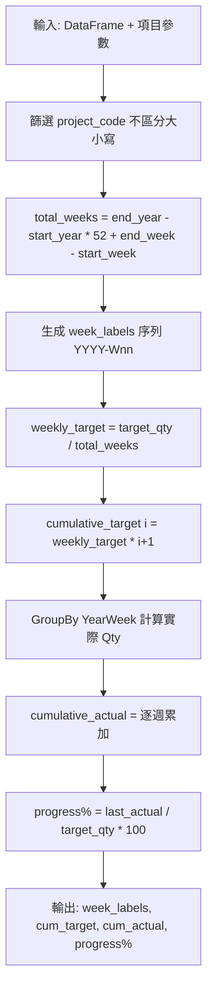

核心公式：
```
weekly_target = target_qty / total_weeks
cumulative_target[i] = weekly_target * (i + 1)
cumulative_actual[i] = cumulative_actual[i-1] + actual_qty_for_week[i]
progress% = cumulative_actual[-1] / target_qty * 100
```

週標籤生成邏輯：從 start_year/start_week 開始遞增，week > 52 時 rollover 至下一年 week 1。

---

#### `plot_scurve(...) -> Optional[str]`

目的：生成 S-Curve 圖表（base64 PNG 或檔案）。

視覺元素：
1. 目標線：藍色虛線，linewidth=2，alpha=0.7
2. 實際線：綠色實線，linewidth=2.5，圓形標記 size=4
3. 填充區域：超前為綠色（alpha=0.2），落後為紅色（alpha=0.2）
4. X 軸：每 N 個標籤顯示一個，N = max(1, total_labels // 12)

---

### 2.4 績效分析 (`analysis/performance.py`)

#### `calculate_performance_metrics(df, project_code, target_productivity=3.0) -> Dict`

目的：計算項目的每週生產力指標。

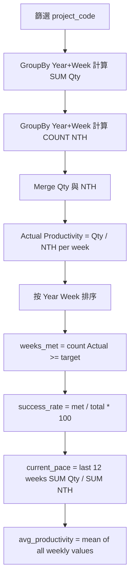

核心公式：
```
actual_productivity_week = qty_delivered_week / nth_count_week
success_rate = weeks_met_target / total_weeks * 100
current_pace = sum(last_12_weeks_qty) / sum(last_12_weeks_nth)
```

---

#### `get_recovery_path(target_qty, actual_qty, remaining_weeks, current_productivity) -> Dict`

目的：計算達成目標所需的恢復路徑。

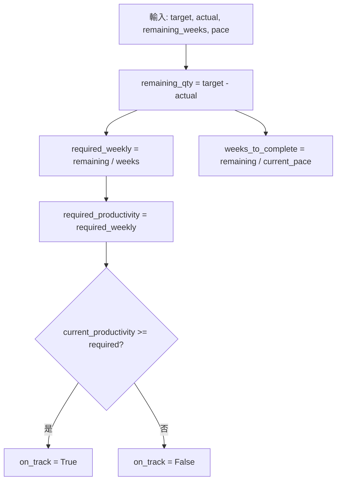

---

#### `plot_performance_chart(...) -> Optional[str]`

視覺元素：
1. 長條圖：達標為綠色，未達標為紅色（alpha=0.7）
2. 水平目標線：藍色虛線，linewidth=2
3. X 軸：每 N 個標籤顯示，N = max(1, total // 10)

---

#### `plot_cumulative_progress(...) -> Optional[str]`

演算法：
1. 篩選項目，GroupBy Year，SUM Qty Delivered，cumsum 計算實際累計
2. 線性目標：`yearly_target = target_qty / total_years`，累計 = yearly_target * (i+1)
3. 恢復路徑：`np.linspace` 從 last_actual_value 到 target_qty
4. 繪製：Plan（藍色虛線）、Actual（綠色實線+標記）、Recovery（紅色點線）

---

### 2.5 人力分析 (`analysis/manpower.py`)

#### `get_daily_headcount(records) -> List[Dict]`

目的：計算每日每班次的人數。

公式：
```
headcount = len(on_duty_names) + len(apprentices) + term_labour_count + sum(team_counts.values())
```

---

#### `get_team_distribution(records) -> Dict[str, Dict[str, int]]`

目的：按週匯總團隊（S2/S3/S4/S5）分配。

演算法：從所有 jobs 的 team_counts 中累加每個 team_id 的數量，按週分組，按週號排序。

---

#### `get_job_type_manpower(records) -> Dict[str, Dict]`

目的：計算每種工作類型的平均工人數和角色分佈。

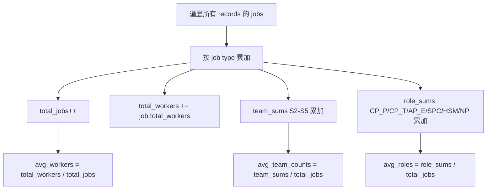

---

#### `get_role_frequency(records) -> List[Dict]`

目的：統計每個人在所有工作中擔任各 EPIC 角色的頻率。

演算法：遍歷所有 jobs 的 roles，對每個角色（CP_P, CP_T, AP_E, SPC, HSM, NP）中的每個人名累加計數。按總分配次數降序排列。

---

#### `get_work_access_analysis(records) -> Dict[str, Dict]`

目的：按工作存取類型分析工作。

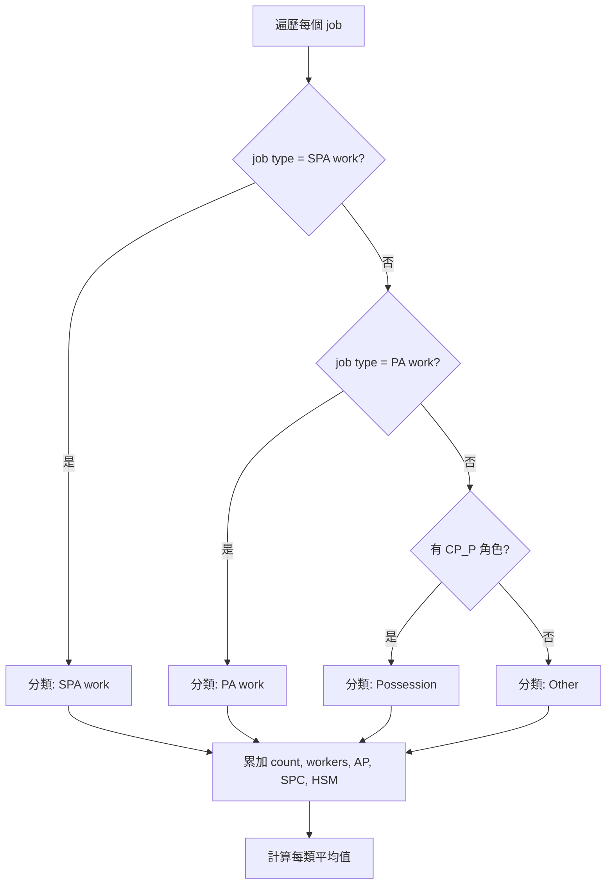

分類邏輯：
- `SPA work`：特殊行人通道工作
- `PA work`：行人通道工作，無工程列車
- `Possession`：有 CP(P) 角色 = 電氣隔離區域中的工程列車
- `Other`：不符合以上類別

---

#### `get_summary_kpis(records) -> Dict`

目的：計算頂層 KPI 摘要。

演算法：
1. `total_jobs` = 所有 records 中 jobs 的總數
2. `avg_workers_per_job` = total_workers / total_jobs
3. `unique_staff_count` = on_duty_names + apprentices + worker_names 的唯一人名數
4. `top_role_holder` = get_role_frequency 結果中排名第一的人

---

#### `export_manpower_excel(records, filepath) -> Path`

目的：匯出人力分析至格式化 Excel 工作簿。

匯出 Sheets：
1. Raw Data：24 欄（Year, Week, Date, Day, Shift, Job Type, Project Code, Description, Qty, Done By, Total Workers, S2-S5, EPIC, CP(P)-HSM, On Duty Count, Apprentices, Term Labour）
2. Job Type Summary：工作類型、總數、平均工人數、平均角色數
3. Role Frequency：人名 x 角色計數矩陣
4. Weekly Team Distribution：每週 S2/S3/S4/S5 分配

---

## 3. 後端模組 (`backend/`)

### 3.1 FastAPI 應用程式 (`backend/main.py`)

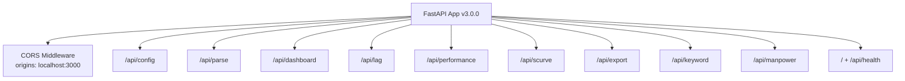

建立 FastAPI app v3.0.0，配置 CORS middleware（origins: localhost:3000, 127.0.0.1:3000），註冊 9 個 router 於 `/api/` 前綴下。健康檢查端點位於 `/` 和 `/api/health`。

### 3.2 設定路由 (`backend/routers/config.py`)

Browse 演算法（原生資料夾選擇）：
1. 建立暫存檔案用於結果和錯誤
2. 清理路徑（反斜線轉正斜線）
3. 生成 Python 腳本：設定 DPI 感知、建立隱藏 tkinter root、開啟 filedialog.askdirectory()
4. 以 subprocess 啟動 python.exe 執行腳本
5. 從暫存檔案讀取結果，正斜線轉回反斜線
6. 清理所有暫存檔案

### 3.3 解析路由 (`backend/routers/parse.py`)

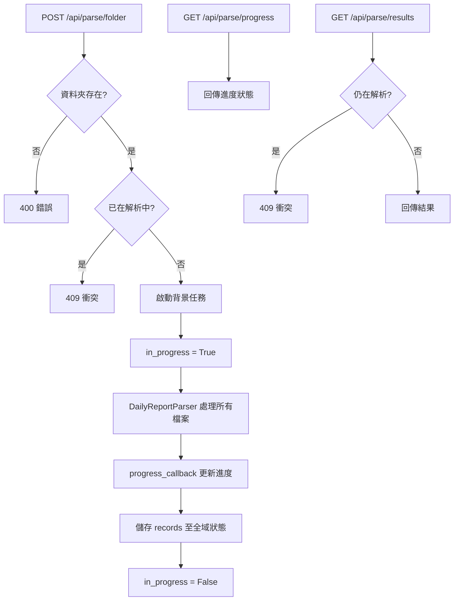

### 3.4 儀表板路由 (`backend/routers/dashboard.py`)

`convert_to_native(obj)` — 遞迴類型序列化：
- dict -> 遞迴處理 values
- list -> 遞迴處理 items
- np.integer -> int
- np.floating -> float
- np.ndarray -> .tolist()
- pd.Timestamp -> .isoformat()
- pd.isna -> None

### 3.5 績效路由 — 累計數據端點

`GET /api/performance/cumulative-data/{project_code}` 演算法：

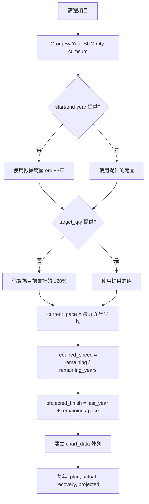

### 3.6 關鍵字路由 (`backend/routers/keyword.py`)

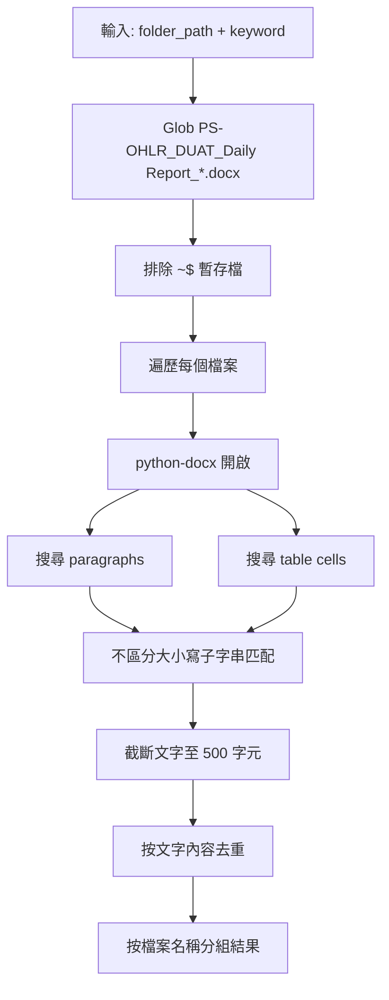

### 3.7 人力路由 (`backend/routers/manpower.py`)

`_serialize(obj)` 輔助函式：遞迴將 defaultdict 和巢狀結構轉換為純 dict/list 以供 JSON 序列化。

---

## 4. 數據流總覽

### 4.1 主要數據流：DOCX -> Dashboard -> 分析

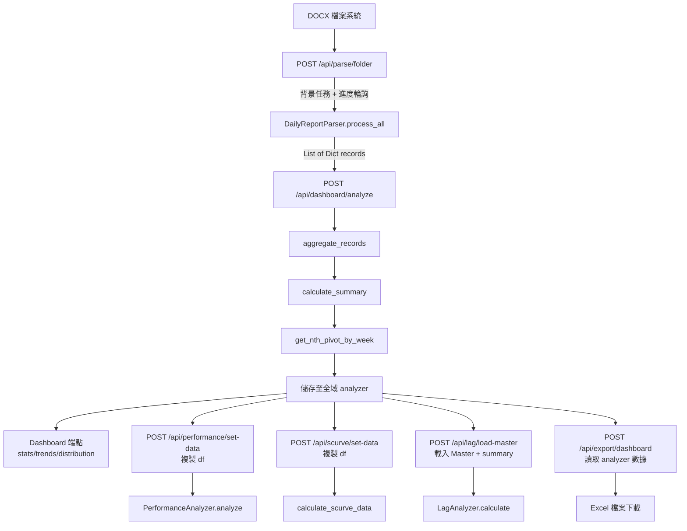

### 4.2 人力數據流（獨立）

```mermaid
graph TD
    DOCX["DOCX 檔案"] --> Scan["POST /api/manpower/scan"]
    Scan --> MP["ManpowerParser.process_all"]
    MP --> State["manpower_state records"]
    State --> Analysis["GET /api/manpower/analysis"]
    Analysis --> KPI["summary_kpis"]
    Analysis --> JT["job_type_manpower"]
    Analysis --> RF["role_frequency"]
    Analysis --> TD2["team_distribution"]
    Analysis --> WA["work_access_analysis"]
    State --> Export["POST /api/manpower/export"]
    Export --> Excel["Excel 4 sheets"]
```

### 4.3 關鍵字搜尋流程（獨立）

```mermaid
graph LR
    Input["folder_path + keyword"] --> Search["POST /api/keyword/search"]
    Search --> Glob["glob DOCX 檔案"]
    Glob --> Scan["python-docx 搜尋<br/>paragraphs + table cells"]
    Scan --> Results["filename + matches"]
```
