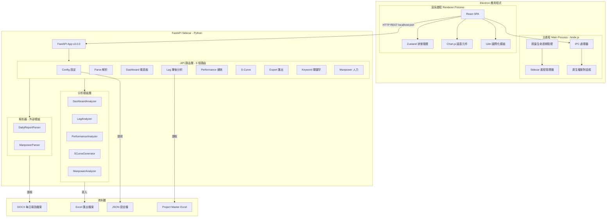
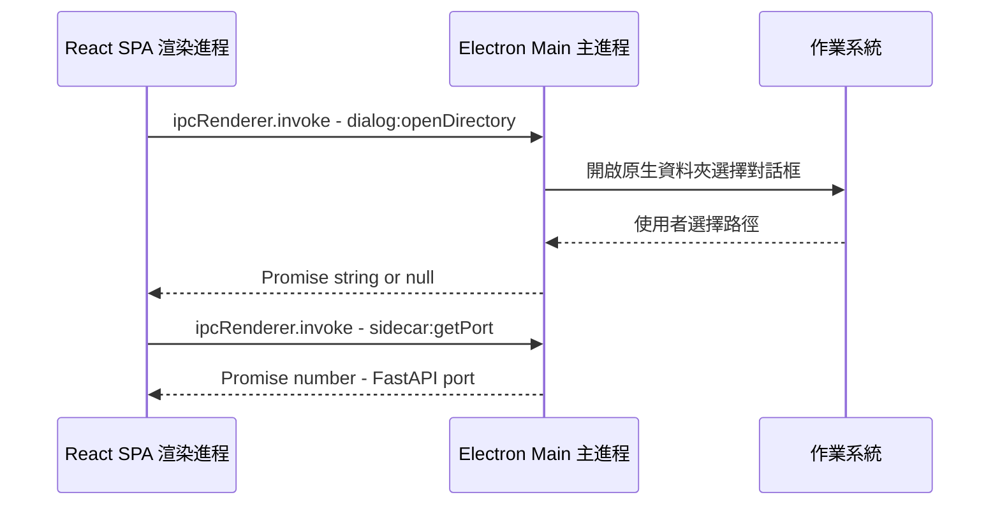
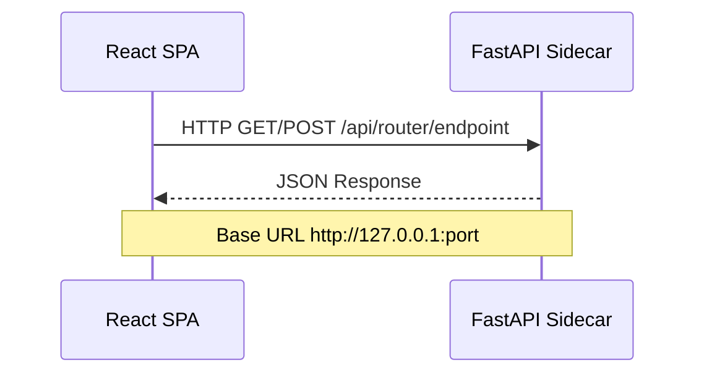
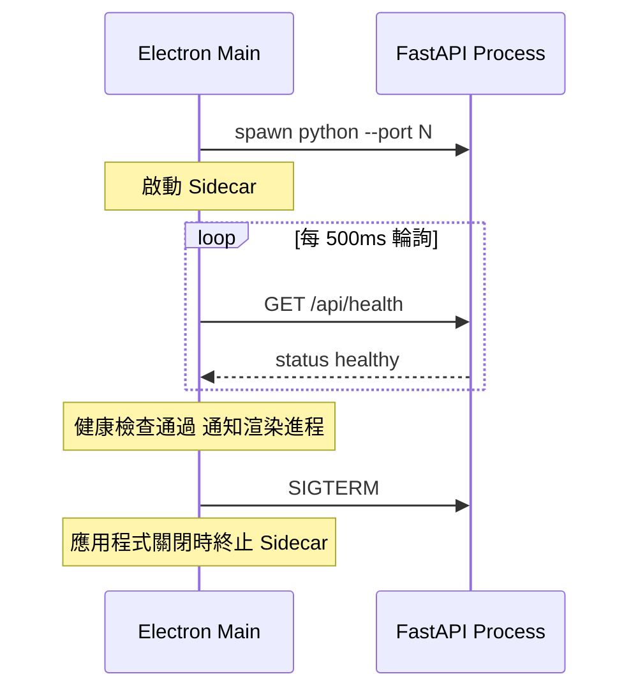
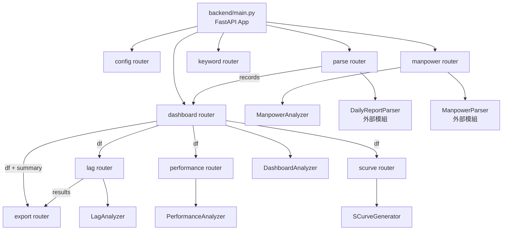
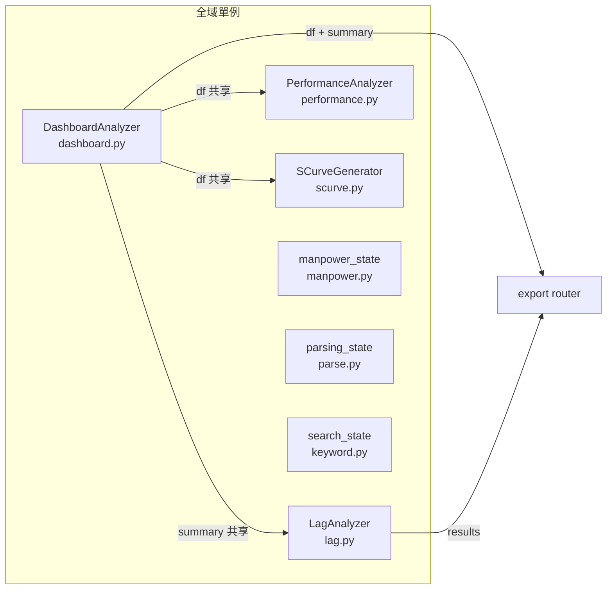
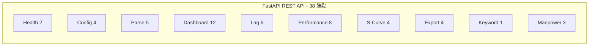
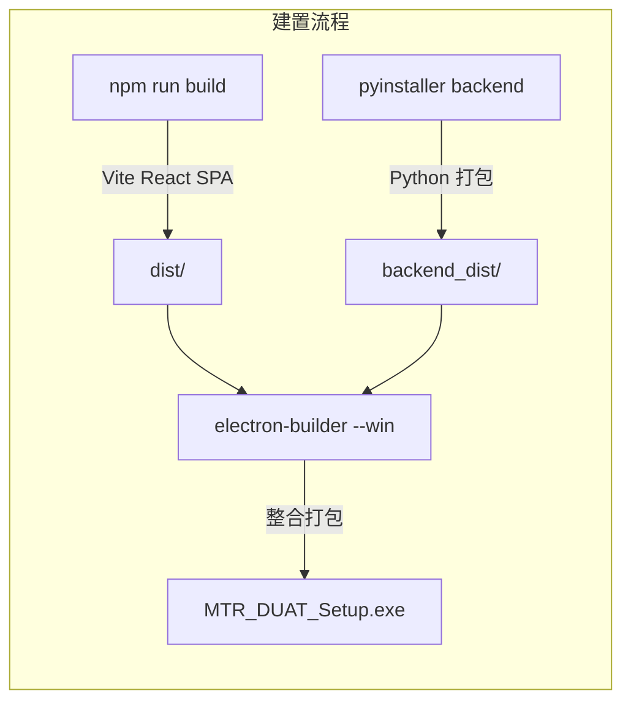
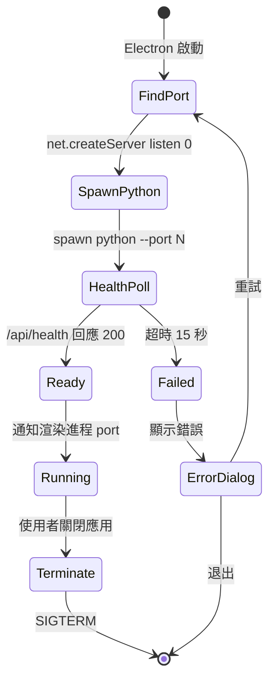

# 系統架構文件

## MTR PS-OHLR DUAT - 每日更新分析工具

---

## 1. 系統概覽

MTR PS-OHLR DUAT（Daily Update Analysis Tool）是為 MTR 電力系統架空線更新（PS-OHLR）團隊開發的桌面應用程式。系統解析每日報告 DOCX 檔案，匯總項目交付數據，並提供分析儀表板、滯後/超前分析、績效追蹤、S-Curve 生成、關鍵字搜尋及人力分析功能。

- 現行架構：Python FastAPI 後端 + 分析模組
- 目標架構：Electron + React SPA + FastAPI Sidecar 混合桌面應用

---

## 2. 高層架構圖



---

## 3. 四層架構

```mermaid
graph LR
    subgraph L1["展示層 Presentation"]
        direction TB
        R1["React SPA"]
        R2["Tailwind CSS + Preline UI"]
        R3["Chart.js 圖表"]
        R4["Zustand 狀態管理"]
    end

    subgraph L2["應用層 Application"]
        direction TB
        E1["Electron Main Process"]
        E2["視窗生命週期"]
        E3["原生檔案對話框"]
        E4["Sidecar 進程管理"]
    end

    subgraph L3["業務邏輯層 Business Logic"]
        direction TB
        F1["FastAPI v3.0.0"]
        F2["9 個 API Router"]
        F3["5 個 Analyzer 模組"]
        F4["2 個 Parser 模組"]
    end

    subgraph L4["資料層 Data"]
        direction TB
        D1["DOCX 報告檔案"]
        D2["Excel 匯出"]
        D3["JSON 設定"]
        D4["Project Master"]
    end

    L1 -->|"Electron IPC"| L2
    L1 -->|"HTTP REST"| L3
    L2 -->|"spawn / SIGTERM"| L3
    L3 -->|"File I/O"| L4
```



| 層級 | 技術 | 職責 |
|------|------|------|
| 展示層 | React + Tailwind + Preline + Chart.js | UI 渲染、圖表、使用者互動 |
| 應用層 | Electron Main Process (Node.js) | 視窗管理、原生對話框、Sidecar 管理 |
| 業務邏輯層 | FastAPI (Python 3.12+) | REST API、DOCX 解析、分析計算、匯出 |
| 資料層 | 檔案系統 | DOCX 報告、Excel 匯出、JSON 設定 |

---

## 4. 原始碼結構

```
mtr_duat/
├── analysis/                    # 業務邏輯 / 分析模組
│   ├── __init__.py              # 模組匯出
│   ├── dashboard.py             # 儀表板數據匯總 (DashboardAnalyzer)
│   ├── lag_analysis.py          # NTH 滯後/超前分析 (LagAnalyzer)
│   ├── scurve.py                # S-Curve 生成 (SCurveGenerator)
│   ├── performance.py           # 績效指標分析 (PerformanceAnalyzer)
│   └── manpower.py              # 人力分析 (ManpowerAnalyzer)
├── backend/                     # FastAPI REST API 層
│   ├── __init__.py
│   ├── main.py                  # FastAPI 入口、CORS、路由註冊
│   └── routers/                 # API 端點處理器
│       ├── __init__.py
│       ├── config.py            # 設定管理 (4 端點)
│       ├── parse.py             # DOCX 解析 (5 端點)
│       ├── dashboard.py         # 儀表板分析 (12 端點)
│       ├── lag.py               # 滯後分析 (6 端點)
│       ├── performance.py       # 績效分析 (8 端點)
│       ├── scurve.py            # S-Curve (4 端點)
│       ├── export.py            # Excel 匯出 (4 端點)
│       ├── keyword.py           # 關鍵字搜尋 (1 端點)
│       └── manpower.py          # 人力分析 (3 端點)
├── docs/                        # 文件
└── build/                       # PyInstaller 建置輸出
```

### 外部依賴模組（引用但不在此 repo 中）

| 模組 | Import 路徑 | 使用者 |
|------|-------------|--------|
| DOCX 解析器 | `parsers.docx_parser` | `backend/routers/parse.py` |
| 人力解析器 | `parsers.manpower_parser` | `backend/routers/manpower.py` |
| 設定模組 | `config` | `backend/routers/config.py` |
| Excel 匯出工具 | `utils.excel_export` | `backend/routers/export.py` |

---

## 5. 通訊模式

### 5.1 React 與 Electron Main 之間 (IPC)



用途：僅用於原生檔案對話框和 port 發現。

### 5.2 React 與 FastAPI 之間 (HTTP REST)



用途：所有數據操作（解析、分析、匯出）。

### 5.3 Electron Main 與 FastAPI 之間（生命週期管理）



---

## 6. 模組互動圖



### 跨路由依賴關係

| 路由 | 依賴 | 依賴類型 |
|------|------|----------|
| `performance` | `dashboard.analyzer` | 匯入全域 DashboardAnalyzer 的 DataFrame |
| `scurve` | `dashboard.analyzer` | 匯入全域 DashboardAnalyzer 的 DataFrame |
| `lag` | `dashboard.analyzer` | 匯入 summary DataFrame 用於 productivity 匹配 |
| `export` | `dashboard.analyzer` + `lag.lag_analyzer` | 匯入兩者用於數據匯出 |
| `manpower` | 無（獨立） | 使用自身 ManpowerParser 數據 |

---

## 7. 技術棧

| 元件 | 技術 | 版本 |
|------|------|------|
| 後端框架 | FastAPI | 3.0.0 |
| ASGI 伺服器 | Uvicorn | latest |
| 數據處理 | pandas, numpy | latest |
| 圖表生成 | matplotlib | latest |
| DOCX 解析 | python-docx | latest |
| Excel 匯出 | openpyxl | latest |
| 前端（規劃中） | React + Vite | 18.x |
| UI 框架（規劃中） | Tailwind CSS + Preline UI | 3.x |
| 圖表（規劃中） | Chart.js | 4.x |
| 狀態管理（規劃中） | Zustand | 4.x |
| 桌面外殼（規劃中） | Electron | latest |
| Python 建置 | PyInstaller | latest |
| 桌面建置 | electron-builder | latest |

---

## 8. 狀態管理

### 8.1 後端狀態（全域單例）



| 路由 | 全域變數 | 類別 | 共享對象 |
|------|----------|------|----------|
| `dashboard.py` | `analyzer` | `DashboardAnalyzer` | performance, scurve, lag, export |
| `lag.py` | `lag_analyzer` | `LagAnalyzer` | export |
| `performance.py` | `perf_analyzer` | `PerformanceAnalyzer` | - |
| `scurve.py` | `scurve_gen` | `SCurveGenerator` | - |
| `manpower.py` | `manpower_state` | dict | - |
| `parse.py` | `parsing_state` | dict | - |
| `keyword.py` | `search_state` | dict | - |

### 8.2 前端狀態（規劃中 - Zustand Store）

```typescript
AppState {
  language: "en" | "zh"
  lastFolderPath: string
  dashboardStats: DashboardStats | null
  dashboardLoaded: boolean
  lagResults: LagResult[]
  isLoading: boolean
  notification: Notification | null
  backendPort: number | null
  backendReady: boolean
  sidecarError: string | null
}
```

---

## 9. API 端點目錄（38 個端點）



### 健康檢查 (2)
| 方法 | 路徑 | 說明 |
|------|------|------|
| GET | `/` | 根健康檢查 |
| GET | `/api/health` | API 健康檢查 |

### 設定管理 (4)
| 方法 | 路徑 | 說明 |
|------|------|------|
| GET | `/api/config` | 取得目前設定 |
| PUT | `/api/config` | 更新設定欄位 |
| POST | `/api/config/reset` | 重設為預設值 |
| GET | `/api/config/browse` | 原生資料夾選擇對話框 |

### 解析 (5)
| 方法 | 路徑 | 說明 |
|------|------|------|
| POST | `/api/parse/docx` | 解析單一 DOCX 檔案 |
| POST | `/api/parse/folder` | 解析資料夾（背景處理） |
| GET | `/api/parse/progress` | 輪詢解析進度 |
| GET | `/api/parse/results` | 取得完成結果 |
| GET | `/api/parse/files` | 列出報告檔案 |

### 儀表板 (12)
| 方法 | 路徑 | 說明 |
|------|------|------|
| POST | `/api/dashboard/analyze` | 分析記錄 |
| POST | `/api/dashboard/load-excel` | 從 Excel 載入 |
| GET | `/api/dashboard/stats` | 摘要統計 |
| GET | `/api/dashboard/summary` | 項目摘要表 |
| GET | `/api/dashboard/trends/weekly` | 每週趨勢 |
| GET | `/api/dashboard/trends/monthly` | 每月 NTH 趨勢 |
| GET | `/api/dashboard/distribution/projects` | 按項目分佈 |
| GET | `/api/dashboard/distribution/keywords` | 按關鍵字分佈 |
| GET | `/api/dashboard/raw-data` | 分頁原始數據 |
| GET | `/api/dashboard/pivot` | NTH 樞紐分析表 |
| GET | `/api/dashboard/distribution/lines` | 按鐵路線分佈 |
| GET | `/api/dashboard/trends/nth-by-project` | 按項目 NTH 趨勢 |

### 滯後分析 (6)
| 方法 | 路徑 | 說明 |
|------|------|------|
| POST | `/api/lag/load-master` | 上傳 Project Master Excel |
| GET | `/api/lag/projects` | 列出已載入項目 |
| PUT | `/api/lag/config/{project_no}` | 更新項目設定 |
| POST | `/api/lag/calculate` | 計算滯後/超前 |
| GET | `/api/lag/results` | 取得結果 |
| GET | `/api/lag/status-legend` | 狀態顏色圖例 |

### 績效分析 (8)
| 方法 | 路徑 | 說明 |
|------|------|------|
| POST | `/api/performance/set-data` | 從儀表板載入數據 |
| GET | `/api/performance/projects` | 可用項目列表 |
| POST | `/api/performance/analyze` | 分析項目績效 |
| GET | `/api/performance/breakdown` | 每週明細 |
| POST | `/api/performance/recovery` | 計算恢復路徑 |
| GET | `/api/performance/chart/weekly/{code}` | 每週圖表 (base64) |
| GET | `/api/performance/chart/cumulative/{code}` | 累計圖表 (base64) |
| GET | `/api/performance/cumulative-data/{code}` | 累計數據 |

### S-Curve (4)
| 方法 | 路徑 | 說明 |
|------|------|------|
| POST | `/api/scurve/set-data` | 從儀表板載入數據 |
| POST | `/api/scurve/calculate` | 計算 S-Curve 數據 |
| POST | `/api/scurve/chart` | 生成圖表 (base64) |
| POST | `/api/scurve/excel` | 生成 Excel 報告 |

### 匯出 (4)
| 方法 | 路徑 | 說明 |
|------|------|------|
| POST | `/api/export/dashboard` | 匯出儀表板 Excel |
| POST | `/api/export/lag-analysis` | 匯出滯後分析 Excel |
| GET | `/api/export/download/{file_type}` | 通用下載 |
| POST | `/api/export/save-dashboard` | 儲存至來源資料夾 |

### 關鍵字搜尋 (1)
| 方法 | 路徑 | 說明 |
|------|------|------|
| POST | `/api/keyword/search` | 搜尋 DOCX 檔案中的關鍵字 |

### 人力分析 (3)
| 方法 | 路徑 | 說明 |
|------|------|------|
| POST | `/api/manpower/scan` | 掃描 DOCX 人力數據 |
| GET | `/api/manpower/analysis` | 完整人力分析 |
| POST | `/api/manpower/export` | 匯出至 Excel |

---

## 10. 建置與部署

### 目標建置流程



### Sidecar 生命週期



---

## 11. 安全考量

- FastAPI 僅綁定 `127.0.0.1`（無外部存取）
- CORS 限制為 `localhost:3000` 和 `127.0.0.1:3000`
- 無需驗證（單使用者桌面應用）
- 檔案路徑在存取前驗證（資料夾存在性檢查）
- 暫存檔案使用後清理（上傳處理、瀏覽對話框）
- 無資料庫 — 所有數據存於記憶體或檔案系統
