# 欄位映射規格文件

## MTR PS-OHLR DUAT - 每日更新分析工具

本文件定義所有參數、欄位、變數、匯入和匯出的標準命名規範、資料類型及完整映射。

---

## 1. 數據流轉換總覽

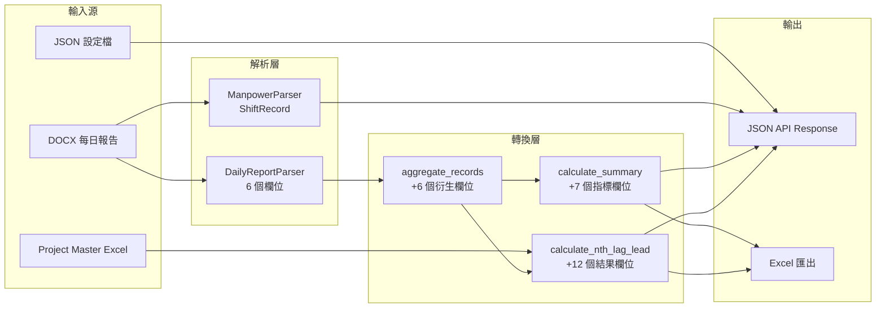

---

## 2. 解析記錄欄位（DOCX Parser 輸出）

由外部 `parsers.docx_parser` 模組產生，供 dashboard router 使用。

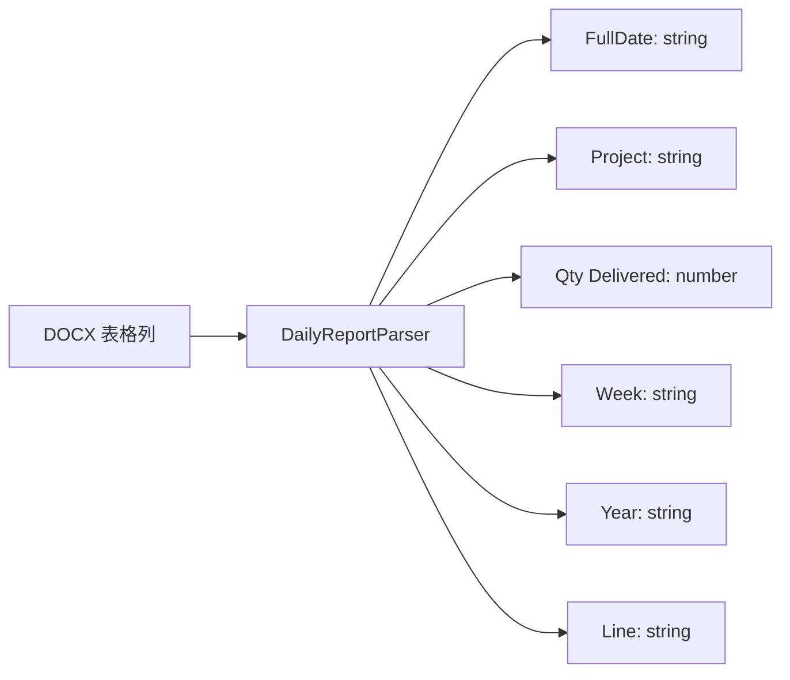

| 標準欄位          | 類型   | 範例                   | 說明                 | 來源                    |
| ----------------- | ------ | ---------------------- | -------------------- | ----------------------- |
| `FullDate`      | string | `"Mon 19/5"`         | 星期縮寫 + 日期      | DOCX 表格列             |
| `Project`       | string | `"C9081"`, `"CBM"` | 項目代碼或工作關鍵字 | DOCX 表格列             |
| `Qty Delivered` | number | `3.0`                | 交付數量             | DOCX 表格列             |
| `Week`          | string | `"21"`               | ISO 週數             | DOCX 檔名/內容          |
| `Year`          | string | `"2025"`             | 日曆年份             | DOCX 檔名/內容          |
| `Line`          | string | `"KTL"`, `""`      | 鐵路線代碼           | DOCX 文字（regex 匹配） |

---

## 3. 儀表板衍生欄位

由 `analysis/dashboard.py:aggregate_records()` 從解析記錄衍生。

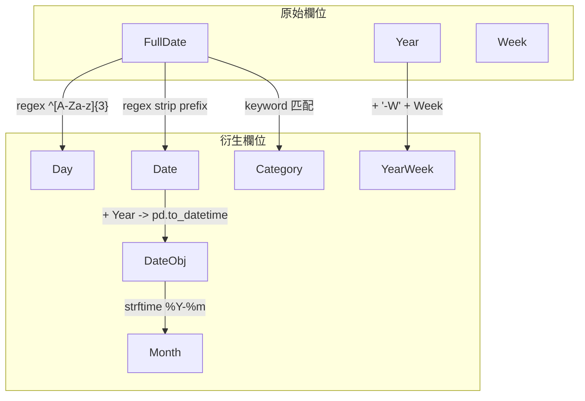

| 欄位         | 類型     | 衍生方式              | 公式/Regex                                               |
| ------------ | -------- | --------------------- | -------------------------------------------------------- |
| `Day`      | string   | 從 FullDate 提取      | Regex:`^([A-Za-z]{3})`                                 |
| `Date`     | string   | FullDate 去除日期前綴 | Regex: strip `^[A-Za-z]{3}\s+`                         |
| `DateObj`  | datetime | 從 Date + Year 解析   | `pd.to_datetime(Date + '/' + Year, format='%d/%m/%Y')` |
| `Month`    | string   | 從 DateObj 衍生       | `DateObj.dt.strftime('%Y-%m')`                         |
| `YearWeek` | string   | Year + Week           | `Year + '-W' + Week.zfill(2)`                          |
| `Category` | string   | 分類                  | Project 匹配關鍵字則為 `'Jobs'`，否則為 `'Projects'` |

---

## 4. 儀表板摘要欄位

由 `analysis/dashboard.py:calculate_summary()` 產生。

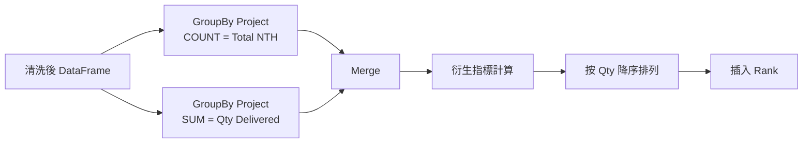

| 欄位                  | 類型   | 公式                                    |
| --------------------- | ------ | --------------------------------------- |
| `Rank`              | int    | 按 Qty Delivered 降序排列後的列號       |
| `Project`           | string | 項目代碼（groupby key）                 |
| `Qty Delivered`     | float  | `SUM(Qty Delivered)` per Project      |
| `Total NTH`         | int    | `COUNT(*)` per Project (groupby size) |
| `Qty per NTH`       | float  | `Qty Delivered / Total NTH`           |
| `Avg Qty per Week`  | float  | `Qty Delivered / current_week`        |
| `Avg Qty per Month` | float  | `Qty Delivered / current_month`       |
| `Avg NTH per Week`  | float  | `Total NTH / current_week`            |
| `Avg NTH per Month` | float  | `Total NTH / current_month`           |

---

## 5. 儀表板統計（API 回應）

由 `DashboardAnalyzer.get_stats()` 回傳。

| 欄位                | 類型   | 說明                                 |
| ------------------- | ------ | ------------------------------------ |
| `total_records`   | int    | `len(df)`                          |
| `total_nth`       | int    | `len(df)`（與 total_records 相同） |
| `total_qty`       | float  | `df['Qty Delivered'].sum()`        |
| `unique_projects` | int    | `df['Project'].nunique()`          |
| `last_updated`    | string | `YYYY-MM-DD HH:MM` 格式            |

---

## 6. 滯後分析欄位

### 6.1 Project Master 輸入（Excel）

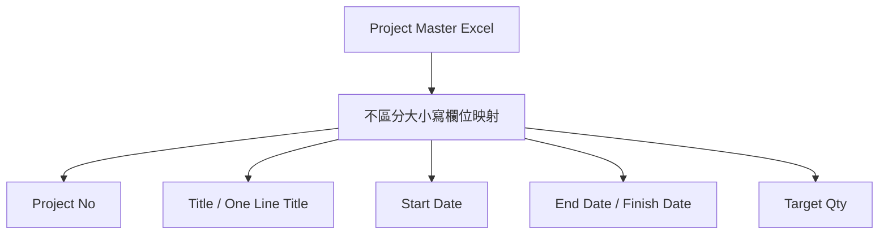

| 標準欄位       | 類型     | 欄位映射（不區分大小寫）                                                  | Fallback           |
| -------------- | -------- | ------------------------------------------------------------------------- | ------------------ |
| `Project No` | string   | `project no`, `projectno`, `project number`                         | Column C (index 2) |
| `Title`      | string   | `one line title`（優先）, `description`, `title`, `project title` | 空字串             |
| `Start Date` | datetime | `start date`, `startdate`                                             | None               |
| `End Date`   | datetime | `finish date`, `end date`, `finishdate`                             | None               |
| `Target Qty` | float    | `target quantity`, `target qty`                                       | None               |

### 6.2 滯後結果輸出

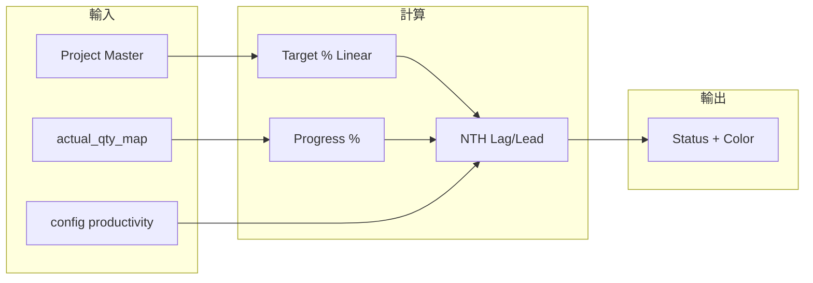

| 欄位                  | 類型   | 說明        | 公式                                             |
| --------------------- | ------ | ----------- | ------------------------------------------------ |
| `Project`           | string | 項目編號    | 來自 Project Master                              |
| `Title`             | string | 項目標題    | 來自 Project Master                              |
| `Start Date`        | string | YYYY-MM-DD  | 來自 Project Master                              |
| `End Date`          | string | YYYY-MM-DD  | 來自 Project Master                              |
| `Target Qty`        | float  | 目標數量    | 來自 Project Master 或 config                    |
| `Actual Qty`        | float  | 實際交付    | 來自 `actual_qty_map`                          |
| `Target % (Linear)` | float  | 時間進度    | `min(100, elapsed_days / total_days * 100)`    |
| `Progress %`        | float  | 實際進度    | `actual_qty / target_qty * 100`                |
| `Productivity`      | float  | 每 NTH 數量 | Config（預設 3.0）或 dashboard 匹配              |
| `NTH Lag/Lead`      | float  | 滯後/超前值 | `(actual_qty - target_to_date) / productivity` |
| `Status`            | string | 狀態標籤    | 基於閾值（見下方）                               |
| `Status Color`      | string | 顯示顏色    | 基於閾值（見下方）                               |

### 6.3 滯後項目設定

| 欄位             | 類型   | 預設值        | 說明                                                   |
| ---------------- | ------ | ------------- | ------------------------------------------------------ |
| `target_qty`   | float  | 來自 Excel    | 目標數量覆寫                                           |
| `productivity` | float  | `3.0`       | 每 NTH 數量率                                          |
| `source`       | string | `"default"` | `"default"`, `"daily_report"`, 或 `"user_input"` |
| `skip`         | bool   | `false`     | 在分析中跳過此項目                                     |

---

## 7. 狀態分類閾值

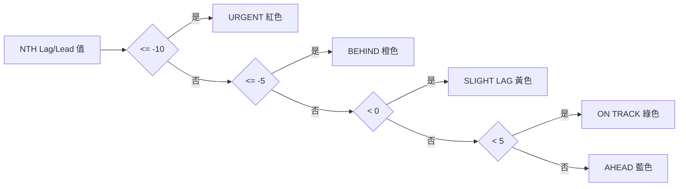

| NTH Lag/Lead 值 | 狀態       | 顏色   | 嚴重程度 |
| --------------- | ---------- | ------ | -------- |
| `<= -10`      | URGENT     | red    | 危急     |
| `<= -5`       | BEHIND     | orange | 高       |
| `< 0`         | SLIGHT LAG | yellow | 中       |
| `< 5`         | ON TRACK   | green  | 正常     |
| `>= 5`        | AHEAD      | blue   | 正面     |

---

## 8. 績效分析欄位

### 8.1 績效指標

| 欄位                    | 類型      | 說明         | 公式                                      |
| ----------------------- | --------- | ------------ | ----------------------------------------- |
| `weekly_data`         | DataFrame | 每週明細     | GroupBy (Year, Week)                      |
| `total_weeks`         | int       | 有數據的週數 | `len(weekly_data)`                      |
| `weeks_met_target`    | int       | 達標週數     | `count(Actual >= target)`               |
| `weeks_missed`        | int       | 未達標週數   | `total - met`                           |
| `success_rate`        | float     | 成功率百分比 | `met / total * 100`                     |
| `target_productivity` | float     | 目標生產力   | 預設 3.0                                  |
| `current_pace`        | float     | 近期步調     | `sum(last_12w_qty) / sum(last_12w_nth)` |
| `avg_productivity`    | float     | 整體平均     | `mean(weekly Actual Productivity)`      |

### 8.2 每週數據欄位

| 欄位                    | 類型   | 公式                          |
| ----------------------- | ------ | ----------------------------- |
| `Year`                | int    | 來自數據                      |
| `Week`                | int    | 來自數據                      |
| `Qty Delivered`       | float  | `SUM` per week              |
| `NTH_Count`           | int    | `COUNT` per week            |
| `Actual Productivity` | float  | `Qty Delivered / NTH_Count` |
| `Label`               | string | `Year-Wnn` 格式             |

### 8.3 恢復路徑

| 欄位                      | 類型       | 公式                                              |
| ------------------------- | ---------- | ------------------------------------------------- |
| `required_weekly`       | float      | `remaining_qty / remaining_weeks`               |
| `required_productivity` | float      | 同 required_weekly                                |
| `on_track`              | bool       | `current_productivity >= required_productivity` |
| `weeks_to_complete`     | float/null | `remaining_qty / current_productivity`          |

### 8.4 累計數據（API 回應）

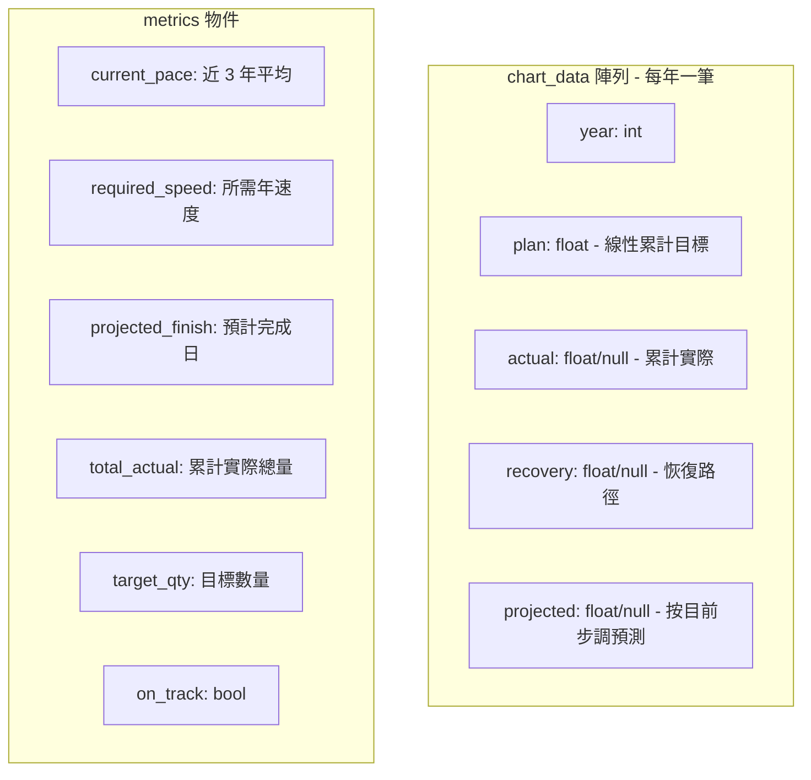

| 欄位                         | 類型        | 說明                               |
| ---------------------------- | ----------- | ---------------------------------- |
| `chart_data[].year`        | int         | 年份                               |
| `chart_data[].plan`        | float       | 線性累計目標                       |
| `chart_data[].actual`      | float/null  | 累計實際（無數據則 null）          |
| `chart_data[].recovery`    | float/null  | 恢復路徑值                         |
| `chart_data[].projected`   | float/null  | 按目前步調預測                     |
| `metrics.current_pace`     | float       | 近 3 年平均年交付量                |
| `metrics.required_speed`   | float       | 達標所需年交付量                   |
| `metrics.projected_finish` | string/null | YYYY-MM-DD 預計完成日              |
| `metrics.total_actual`     | float       | 累計實際總量                       |
| `metrics.target_qty`       | float       | 目標數量                           |
| `metrics.on_track`         | bool        | `current_pace >= required_speed` |

---

## 9. S-Curve 欄位

### 9.1 S-Curve 請求參數

| 欄位             | 類型   | 說明             |
| ---------------- | ------ | ---------------- |
| `project_code` | string | 例如 `"C2264"` |
| `target_qty`   | float  | 目標數量         |
| `start_year`   | int    | 起始年份         |
| `start_week`   | int    | 起始週（1-52）   |
| `end_year`     | int    | 結束年份         |
| `end_week`     | int    | 結束週（1-52）   |

### 9.2 S-Curve 輸出

| 欄位                  | 類型        | 公式                               |
| --------------------- | ----------- | ---------------------------------- |
| `week_labels`       | List[str]   | `YYYY-Wnn` 格式序列              |
| `cumulative_target` | List[float] | `weekly_target * (i + 1)`        |
| `cumulative_actual` | List[float] | 實際數量逐週累加                   |
| `progress_pct`      | float       | `last_actual / target_qty * 100` |

---

## 10. 人力班次記錄欄位

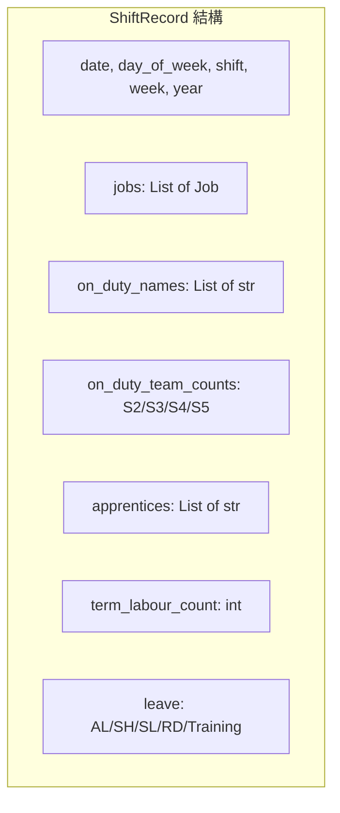

| 欄位                    | 類型          | 說明                             |
| ----------------------- | ------------- | -------------------------------- |
| `date`                | string        | 日期字串                         |
| `day_of_week`         | string        | 星期名稱                         |
| `shift`               | string        | `"Day"` 或 `"Night"`         |
| `week`                | string        | 週數                             |
| `year`                | string        | 年份                             |
| `jobs`                | List[Job]     | 該班次的工作項目                 |
| `on_duty_names`       | List[str]     | 當值工人姓名                     |
| `on_duty_team_counts` | Dict[str,int] | `{S2: n, S3: n, S4: n, S5: n}` |
| `apprentices`         | List[str]     | 學徒姓名                         |
| `term_labour_count`   | int           | 臨時工人數                       |
| `leave.AL`            | List[str]     | 年假姓名                         |
| `leave.SH`            | List[str]     | 法定假日姓名                     |
| `leave.SL`            | List[str]     | 病假姓名                         |
| `leave.RD`            | List[str]     | 休息日姓名                       |
| `leave.Training`      | List[str]     | 培訓姓名                         |

---

## 11. 人力工作欄位

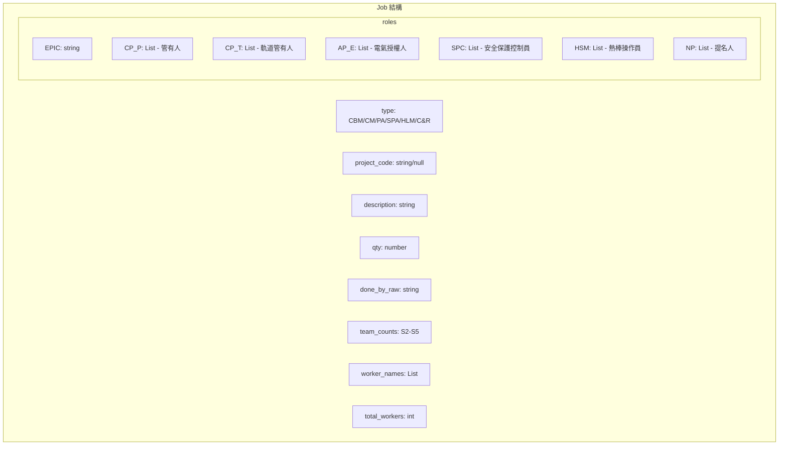

| 欄位              | 類型          | 說明                                                         |
| ----------------- | ------------- | ------------------------------------------------------------ |
| `type`          | string        | `CBM`, `CM`, `PA work`, `SPA work`, `HLM`, `C&R` |
| `project_code`  | string/null   | 項目代碼（例如 `"C9081"`）                                 |
| `description`   | string        | 工作描述文字                                                 |
| `qty`           | number        | 數量                                                         |
| `done_by_raw`   | string        | 原始「完成者」文字                                           |
| `team_counts`   | Dict[str,int] | `{S2: n, S3: n, S4: n, S5: n}`                             |
| `worker_names`  | List[str]     | 個別工人姓名                                                 |
| `total_workers` | int           | 工人總數                                                     |
| `roles.EPIC`    | string        | EPIC 角色字串                                                |
| `roles.CP_P`    | List[str]     | CP(P) - 管有人（Possession）                                 |
| `roles.CP_T`    | List[str]     | CP(T) - 軌道管有人（Track）                                  |
| `roles.AP_E`    | List[str]     | AP(E) - 電氣授權人（Electrical）                             |
| `roles.SPC`     | List[str]     | SPC - 安全保護控制員                                         |
| `roles.HSM`     | List[str]     | HSM - 熱棒操作員                                             |
| `roles.NP`      | List[str]     | NP - 提名人                                                  |

---

## 12. 應用程式設定欄位

| 欄位                     | 類型      | 預設值                                     | 說明                          |
| ------------------------ | --------- | ------------------------------------------ | ----------------------------- |
| `last_folder`          | string    | `""`                                     | 最後使用的資料夾路徑          |
| `language`             | string    | `"en"`                                   | UI 語言：`"en"` 或 `"zh"` |
| `dark_mode`            | bool      | `false`                                  | 深色模式偏好                  |
| `default_productivity` | float     | `3.0`                                    | 預設生產力（Qty/NTH）         |
| `keywords`             | List[str] | `["CBM","CM","PA work","HLM","Provide"]` | 工作類型關鍵字                |

---

## 13. 領域常數

### 13.1 鐵路線代碼

| 代碼 | 全名                            |
| ---- | ------------------------------- |
| KTL  | 觀塘線 Kwun Tong Line           |
| TCL  | 東涌線 Tung Chung Line          |
| AEL  | 機場快線 Airport Express Line   |
| TWL  | 荃灣線 Tsuen Wan Line           |
| ISL  | 港島線 Island Line              |
| TKL  | 將軍澳線 Tseung Kwan O Line     |
| EAL  | 東鐵線 East Rail Line           |
| SIL  | 南港島線 South Island Line      |
| TML  | 屯馬線 Tuen Ma Line             |
| DRL  | 迪士尼線 Disneyland Resort Line |

### 13.2 工作類型關鍵字

| 關鍵字       | 說明                                            |
| ------------ | ----------------------------------------------- |
| `CBM`      | 狀態維修 Condition Based Maintenance            |
| `CM`       | 糾正維修 Corrective Maintenance                 |
| `PA work`  | 行人通道工作 Pedestrian Access work             |
| `SPA work` | 特殊行人通道工作 Special Pedestrian Access work |
| `HLM`      | 高空維修 High Level Maintenance                 |
| `Provide`  | 提供人力進行轉換 Provide manpower for switching |
| `C&R`      | 建造及更新 Construction and Renewal             |

### 13.3 EPIC 安全角色

| 角色代碼             | 全名                           | 說明                         |
| -------------------- | ------------------------------ | ---------------------------- |
| `CP(P)` / `CP_P` | Competent Person (Possession)  | 管理電氣隔離區域中的工程列車 |
| `CP(T)` / `CP_T` | Competent Person (Track)       | 管理軌道通行安全             |
| `AP(E)` / `AP_E` | Authorized Person (Electrical) | 管理電氣隔離                 |
| `SPC`              | Second Person Checker          |                              |
| `HSM`              | Hand Signal Man                | 手號員                       |
| `NP`               | Nominated Person               | 提名安全角色持有人           |

### 13.4 團隊識別碼

| 團隊 ID | 說明                   |
| ------- | ---------------------- |
| `S2`  | 第 2 班組 Shift 2 team |
| `S3`  | 第 3 班組 Shift 3 team |
| `S4`  | 第 4 班組 Shift 4 team |
| `S5`  | 第 5 班組 Shift 5 team |

---

## 14. 模組匯入/匯出映射

### 14.1 模組匯入圖

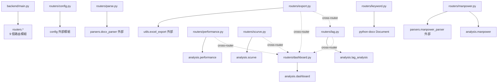

### 14.2 模組匯入表

| 檔案                       | 匯入來源                            | 符號                                                                                                                                                                         |
| -------------------------- | ----------------------------------- | ---------------------------------------------------------------------------------------------------------------------------------------------------------------------------- |
| `backend/main.py`        | `routers.*`                       | config, parse, dashboard, lag, performance, scurve, export, keyword, manpower                                                                                                |
| `routers/config.py`      | `config`（外部）                  | `load_app_config`, `save_app_config`, `DEFAULT_CONFIG`                                                                                                                 |
| `routers/parse.py`       | `parsers.docx_parser`（外部）     | `DailyReportParser`, `process_docx`                                                                                                                                      |
| `routers/dashboard.py`   | `analysis.dashboard`              | `DashboardAnalyzer`, `aggregate_records`, `calculate_summary`, `get_weekly_trend`, `get_monthly_trend`, `get_project_distribution`, `get_keyword_distribution` |
| `routers/lag.py`         | `analysis.lag_analysis`           | `LagAnalyzer`, `get_status`                                                                                                                                              |
| `routers/lag.py`         | `routers/dashboard.py`            | `analyzer`（跨路由）                                                                                                                                                       |
| `routers/performance.py` | `analysis.performance`            | `PerformanceAnalyzer`, `calculate_performance_metrics`, `get_recovery_path`, `plot_performance_chart`, `plot_cumulative_progress`                                  |
| `routers/performance.py` | `routers/dashboard.py`            | `analyzer`（跨路由）                                                                                                                                                       |
| `routers/scurve.py`      | `analysis.scurve`                 | `SCurveGenerator`, `calculate_scurve_data`, `plot_scurve`, `generate_scurve_excel`                                                                                   |
| `routers/scurve.py`      | `routers/dashboard.py`            | `analyzer`（跨路由）                                                                                                                                                       |
| `routers/export.py`      | `utils.excel_export`（外部）      | `export_dataframe_to_excel`, `create_dashboard_excel`, `export_lag_analysis_report`                                                                                    |
| `routers/export.py`      | `routers/dashboard.py`            | `analyzer`（跨路由）                                                                                                                                                       |
| `routers/export.py`      | `routers/lag.py`                  | `lag_analyzer`（跨路由）                                                                                                                                                   |
| `routers/keyword.py`     | `docx`                            | `Document`                                                                                                                                                                 |
| `routers/manpower.py`    | `parsers.manpower_parser`（外部） | `ManpowerParser`                                                                                                                                                           |
| `routers/manpower.py`    | `analysis.manpower`               | `ManpowerAnalyzer`                                                                                                                                                         |

### 14.3 Excel 匯出 Sheets

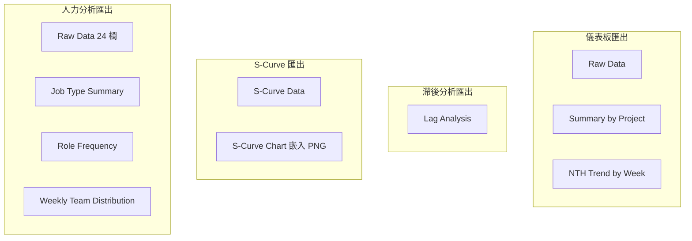

| 匯出類型 | Sheet 名稱               | 主要欄位                                                           |
| -------- | ------------------------ | ------------------------------------------------------------------ |
| 儀表板   | Raw Data                 | Year, Day, Date, Week, Project, Qty Delivered                      |
| 儀表板   | Summary by Project       | Rank, Project, Qty Delivered, Total NTH, 衍生指標                  |
| 儀表板   | NTH Trend by Week        | YearWeek (index), Project 欄位, NTH 計數                           |
| 滯後分析 | Lag Analysis             | Project, Title, dates, Target Qty, Actual Qty, percentages, Status |
| S-Curve  | S-Curve Data             | Week, Target (Cumulative), Actual (Cumulative), Variance           |
| S-Curve  | S-Curve Chart            | 嵌入 PNG 圖表影像                                                  |
| 人力     | Raw Data                 | 24 欄（Year 至 Term Labour）                                       |
| 人力     | Job Type Summary         | Job Type, 總數, 工人和角色平均值                                   |
| 人力     | Role Frequency           | Name, CP(P), CP(T), AP(E), SPC, HSM, NP, Total                     |
| 人力     | Weekly Team Distribution | Week, S2, S3, S4, S5, Total                                        |

---

## 15. 已知問題

`analysis/__init__.py` 在 `__all__` 中匯出 `get_possession_vs_track_access`，但此函式不存在。實際函式為 `get_work_access_analysis`。這是一個遺留命名不匹配，應予修正。

```python
# 目前（不正確）：
'get_possession_vs_track_access',
# 應為：
'get_work_access_analysis',
```
