# 重建計劃文件

## MTR PS-OHLR DUAT - 每日更新分析工具

**版本**: 4.0.0
**日期**: 2026-02-13
**目標**: 從 Python Flet + FastAPI 重建為 Electron + React + FastAPI 混合桌面應用，打包為可攜式 .exe

---

## 1. 專案背景與目標

### 1.1 現況

MTR PS-OHLR DUAT 目前由以下元件組成：
- Python FastAPI 後端（9 個 API router，38 個端點）
- 5 個分析模組（Dashboard, Lag, Performance, S-Curve, Manpower）
- 4 個外部依賴模組（需重新開發：docx_parser, manpower_parser, config, excel_export）
- 無前端 React codebase（需從零建立）

### 1.2 目標架構

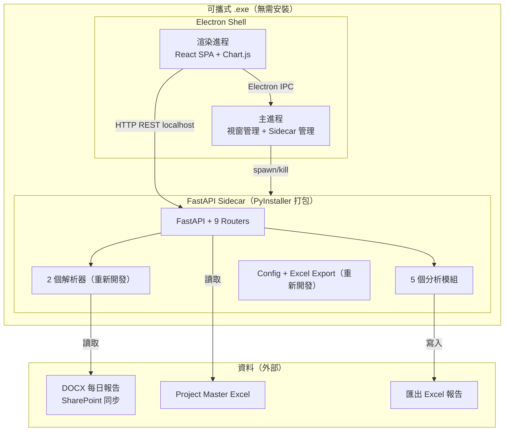
```mermaid
graph TB
    subgraph Package["可攜式 .exe（無需安裝）"]
        subgraph Electron["Electron Shell"]
            MainProc["主進程<br/>視窗管理 + Sidecar 管理"]
            Renderer["渲染進程<br/>React SPA + Chart.js"]
        end
        subgraph Sidecar["FastAPI Sidecar（PyInstaller 打包）"]
            API["FastAPI + 9 Routers"]
            Analysis["5 個分析模組"]
            Parsers["2 個解析器（重新開發）"]
            Utils["Config + Excel Export（重新開發）"]
        end
    end
    subgraph Data["資料（外部）"]
        DOCX["DOCX 每日報告<br/>SharePoint 同步"]
        Excel["Project Master Excel"]
        Output["匯出 Excel 報告"]
    end

    MainProc -->|"spawn/kill"| Sidecar
    Renderer -->|"HTTP REST localhost"| API
    Renderer -->|"Electron IPC"| MainProc
    API --> Analysis
    API --> Parsers
    Parsers -->|讀取| DOCX
    Analysis -->|寫入| Output
    API -->|讀取| Excel
```

### 1.3 部署環境

| 項目 | 說明 |
|------|------|
| 目標作業系統 | Windows 10/11 |
| 網路環境 | 企業內部網路，可存取 SharePoint，有網際網路 |
| 安裝限制 | 無法安裝任何程式，僅能執行可攜式 .exe |
| 資料來源 | DOCX 檔案透過 SharePoint 同步至本機 |
| 分發方式 | 可攜式 .exe 獨立分享，可離線運作 |
| 使用者數量 | 多台獨立電腦，單使用者模式 |

### 1.4 關鍵約束

1. 可攜式 .exe — 不依賴 Python/Node.js 安裝
2. 離線運作 — 所有功能不需網路連線
3. 無安裝權限 — 不能寫入 Program Files 或 Registry
4. SharePoint 相容 — 可讀取 SharePoint 同步的本機資料夾

---

## 2. 差距分析 (Gap Analysis)

### 2.1 現有 vs 目標對照

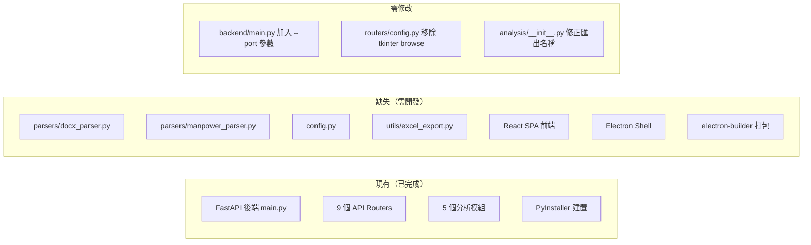
```mermaid
graph LR
    subgraph Current["現有（已完成）"]
        C1["FastAPI 後端 main.py"]
        C2["9 個 API Routers"]
        C3["5 個分析模組"]
        C4["PyInstaller 建置"]
    end

    subgraph Missing["缺失（需開發）"]
        M1["parsers/docx_parser.py"]
        M2["parsers/manpower_parser.py"]
        M3["config.py"]
        M4["utils/excel_export.py"]
        M5["React SPA 前端"]
        M6["Electron Shell"]
        M7["electron-builder 打包"]
    end

    subgraph Modify["需修改"]
        X1["backend/main.py 加入 --port 參數"]
        X2["routers/config.py 移除 tkinter browse"]
        X3["analysis/__init__.py 修正匯出名稱"]
    end
```

### 2.2 詳細差距清單

| 類別 | 元件 | 現況 | 目標 | 差距 | 優先級 |
|------|------|------|------|------|--------|
| 解析器 | `parsers/docx_parser.py` | 不存在 | DOCX 解析 + Line 提取 | 全新開發 | P0 |
| 解析器 | `parsers/manpower_parser.py` | 不存在 | 人力班次解析 | 全新開發 | P0 |
| 工具 | `config.py` | 不存在 | JSON 設定讀寫 | 全新開發 | P0 |
| 工具 | `utils/excel_export.py` | 不存在 | Excel 匯出工具 | 全新開發 | P1 |
| 前端 | React SPA | 不存在 | 7 個頁面 + 圖表 | 全新開發 | P0 |
| 前端 | Zustand Store | 不存在 | 狀態管理 | 全新開發 | P0 |
| 前端 | i18n 模組 | 不存在 | 中英文切換 | 全新開發 | P1 |
| 桌面 | Electron Main | 不存在 | 視窗 + Sidecar 管理 | 全新開發 | P0 |
| 桌面 | Electron Preload | 不存在 | IPC 橋接 | 全新開發 | P0 |
| 建置 | electron-builder | 不存在 | 可攜式 .exe 打包 | 全新配置 | P0 |
| 後端 | `backend/main.py` | 已存在 | 加入 `--port` CLI 參數 | 小幅修改 | P0 |
| 後端 | `routers/config.py` | tkinter browse | Electron 原生對話框 | 移除 tkinter | P1 |
| 後端 | `analysis/__init__.py` | 匯出名稱錯誤 | 修正 `get_work_access_analysis` | Bug 修正 | P2 |

### 2.3 外部依賴模組規格

以下模組需根據現有 import 簽名重新開發：

#### `parsers/docx_parser.py`

```python
# 必須匯出
class DailyReportParser:
    def __init__(self, folder_path: Path): ...
    def get_report_files(self) -> List[Path]: ...
    def process_all(self, progress_callback=None) -> List[Dict]: ...
    def get_max_week(self) -> int: ...

def process_docx(filepath: Path) -> List[Dict]: ...
```

輸出記錄格式：`{FullDate, Project, Qty Delivered, Week, Year, Line}`

#### `parsers/manpower_parser.py`

```python
class ManpowerParser:
    def __init__(self, folder_path: Path): ...
    def get_report_files(self) -> List[Path]: ...
    def process_all(self) -> List[Dict]: ...
```

輸出格式：參見 [field-mapping-spc.md](field-mapping-spc.md) 第 10-11 節

#### `config.py`

```python
DEFAULT_CONFIG: Dict  # 預設設定
def load_app_config() -> Dict: ...
def save_app_config(config: Dict) -> bool: ...
```

#### `utils/excel_export.py`

```python
def export_dataframe_to_excel(df, path) -> bool: ...
def create_dashboard_excel(raw_df, summary_df, path, nth_trend=None) -> bool: ...
def export_lag_analysis_report(results_df, path) -> bool: ...
```

---

## 3. 開發計劃 (Development Plan)

### 3.1 階段總覽

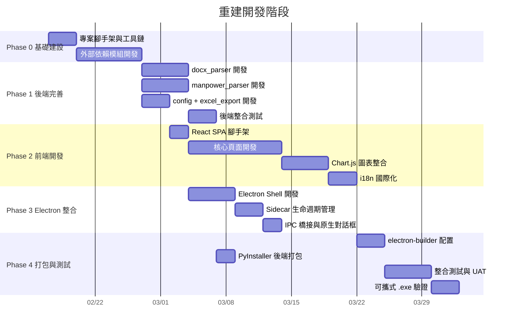
```mermaid
gantt
    title 重建開發階段
    dateFormat YYYY-MM-DD
    axisFormat %m/%d

    section Phase 0 基礎建設
    專案腳手架與工具鏈          :p0a, 2026-02-17, 3d
    外部依賴模組開發             :p0b, after p0a, 7d

    section Phase 1 後端完善
    docx_parser 開發             :p1a, after p0b, 5d
    manpower_parser 開發         :p1b, after p0b, 5d
    config + excel_export 開發   :p1c, after p0b, 3d
    後端整合測試                 :p1d, after p1a, 3d

    section Phase 2 前端開發
    React SPA 腳手架             :p2a, after p1c, 2d
    核心頁面開發                 :p2b, after p2a, 10d
    Chart.js 圖表整合            :p2c, after p2b, 5d
    i18n 國際化                  :p2d, after p2c, 3d

    section Phase 3 Electron 整合
    Electron Shell 開發          :p3a, after p2a, 5d
    Sidecar 生命週期管理         :p3b, after p3a, 3d
    IPC 橋接與原生對話框         :p3c, after p3b, 2d

    section Phase 4 打包與測試
    electron-builder 配置        :p4a, after p2d, 3d
    PyInstaller 後端打包         :p4b, after p1d, 2d
    整合測試與 UAT               :p4c, after p4a, 5d
    可攜式 .exe 驗證             :p4d, after p4c, 3d
```

### 3.2 Phase 0：基礎建設（預計 10 天）

#### 3.2.1 專案腳手架

| 步驟 | 任務 | 產出 |
|------|------|------|
| 0.1 | 初始化 monorepo 結構 | `package.json`, `pyproject.toml` |
| 0.2 | 配置 Vite + React + TypeScript | `frontend/` 目錄 |
| 0.3 | 配置 Tailwind CSS + Preline UI | `tailwind.config.js` |
| 0.4 | 配置 ESLint + Prettier | `.eslintrc`, `.prettierrc` |
| 0.5 | 配置 pytest + coverage | `pytest.ini`, `conftest.py` |

目標目錄結構：
```
mtr_duat/
├── frontend/                    # React SPA（從零建立）
│   ├── src/
│   │   ├── components/          # 共用元件
│   │   ├── pages/               # 7 個頁面
│   │   ├── lib/                 # api.ts, store.ts, i18n.ts
│   │   └── App.tsx
│   ├── package.json
│   ├── vite.config.ts
│   └── tailwind.config.js
├── electron/                    # Electron Shell（從零建立）
│   ├── main.js                  # 主進程
│   ├── preload.js               # IPC 橋接
│   └── sidecar.js               # Sidecar 管理器
├── analysis/                    # 現有分析模組（保留）
├── backend/                     # 現有 FastAPI（小幅修改）
├── parsers/                     # 解析器（重新開發）
│   ├── __init__.py
│   ├── docx_parser.py
│   └── manpower_parser.py
├── utils/                       # 工具模組（重新開發）
│   ├── __init__.py
│   └── excel_export.py
├── config.py                    # 設定模組（重新開發）
├── docs/                        # 文件
└── build/                       # 建置輸出
```

#### 3.2.2 外部依賴模組開發

按依賴順序開發：

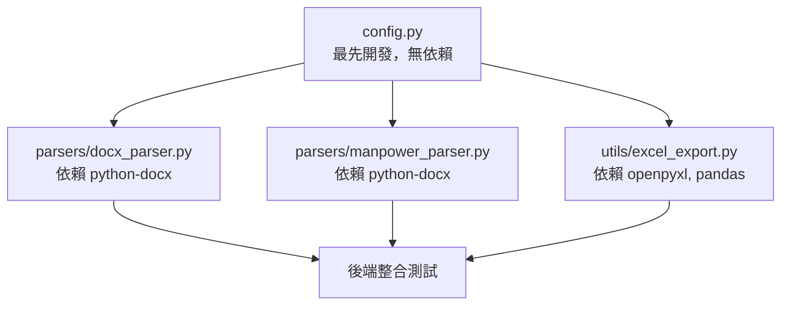
```mermaid
graph TD
    A["config.py<br/>最先開發，無依賴"] --> B["parsers/docx_parser.py<br/>依賴 python-docx"]
    A --> C["parsers/manpower_parser.py<br/>依賴 python-docx"]
    A --> D["utils/excel_export.py<br/>依賴 openpyxl, pandas"]
    B --> E["後端整合測試"]
    C --> E
    D --> E
```

### 3.3 Phase 1：後端完善（預計 13 天）

#### 3.3.1 docx_parser 開發

| 步驟 | 任務 | 驗收標準 |
|------|------|----------|
| 1.1 | 實作 `DailyReportParser` 類別 | 可掃描資料夾中的 DOCX 檔案 |
| 1.2 | 實作藍色文字偵測邏輯 | 正確識別 CBM/CM/PA work/HLM/Provide |
| 1.3 | 實作項目代碼提取（C#### 格式） | 正確提取 Project 和 Qty Delivered |
| 1.4 | 實作鐵路線代碼提取（regex） | 正確匹配 KTL/TCL/AEL 等 10 條線 |
| 1.5 | 實作 progress_callback 機制 | 背景解析時可回報進度 |
| 1.6 | 實作夜班零數量記錄邏輯 | 夜班藍色關鍵字產生 qty=0 記錄 |
| 1.7 | 錯誤處理：損壞檔案跳過 | 記錄錯誤並繼續處理 |

關鍵演算法（參見 [algorithm.md](algorithm.md)）：
- 藍色文字偵測：檢查 `run.font.color.rgb` 是否為藍色系
- Line 提取：regex `\b(KTL|TCL|AEL|TWL|ISL|TKL|EAL|SIL|TML|DRL)\b`
- 檔案匹配：glob `PS-OHLR_DUAT_Daily Report_*.docx`，排除 `~$` 前綴

#### 3.3.2 manpower_parser 開發

| 步驟 | 任務 | 驗收標準 |
|------|------|----------|
| 1.8 | 實作 `ManpowerParser` 類別 | 可解析 DOCX 第二個表格 |
| 1.9 | 實作班次內容分段邏輯 | 正確分割 HLM/C&R/Attendance 區段 |
| 1.10 | 實作工作項目提取 | 正確識別 job type, project_code, qty |
| 1.11 | 實作 EPIC 角色解析 | 正確提取 CP_P/CP_T/AP_E/SPC/HSM/NP |
| 1.12 | 實作團隊計數解析（S2-S5） | 正確解析 "S2x3, S3x2" 格式 |
| 1.13 | 實作請假資料分類 | 正確分類 AL/SH/SL/RD/Training |

#### 3.3.3 config + excel_export 開發

| 步驟 | 任務 | 驗收標準 |
|------|------|----------|
| 1.14 | 實作 `config.py` | JSON 讀寫 + DEFAULT_CONFIG 合併 |
| 1.15 | 設定檔路徑策略 | 可攜式：與 .exe 同目錄下 `config.json` |
| 1.16 | 實作 `excel_export.py` | 3 個匯出函式通過測試 |

設定檔路徑策略（可攜式環境）：
```python
# 不使用 ~/.mtr_duat_config.json（可能無寫入權限）
# 改為與執行檔同目錄
config_path = Path(sys.executable).parent / "mtr_duat_config.json"
# 開發模式 fallback
if not config_path.parent.exists():
    config_path = Path.cwd() / "mtr_duat_config.json"
```

#### 3.3.4 後端修改

| 步驟 | 任務 | 影響範圍 |
|------|------|----------|
| 1.17 | `backend/main.py` 加入 `--port` CLI 參數 | 1 個檔案 |
| 1.18 | `routers/config.py` 移除 tkinter browse | 1 個端點 |
| 1.19 | `analysis/__init__.py` 修正匯出名稱 | 1 行 |

### 3.4 Phase 2：前端開發（預計 20 天）

#### 3.4.1 React SPA 腳手架

```
frontend/src/
├── components/
│   ├── Layout.tsx               # 側邊欄 + 頂部導航
│   ├── Sidebar.tsx              # 導航選單
│   ├── LoadingOverlay.tsx       # 載入中覆蓋層
│   ├── NotificationToast.tsx    # 通知提示
│   ├── charts/                  # Chart.js 封裝元件
│   │   ├── BarChart.tsx
│   │   ├── LineChart.tsx
│   │   ├── PieChart.tsx
│   │   └── SCurveChart.tsx
│   └── tables/
│       ├── DataTable.tsx        # 通用數據表格
│       └── PivotTable.tsx       # 樞紐分析表
├── pages/
│   ├── HomePage.tsx             # 首頁：資料夾選擇 + 解析
│   ├── GeneratePage.tsx         # 生成儀表板
│   ├── DashboardPage.tsx        # 儀表板：統計 + 圖表
│   ├── LagAnalysisPage.tsx      # NTH 滯後分析
│   ├── PerformancePage.tsx      # 績效追蹤
│   ├── KeywordSearchPage.tsx    # 關鍵字搜尋
│   └── ManpowerPage.tsx         # 人力分析
├── lib/
│   ├── api.ts                   # API 客戶端（動態 port）
│   ├── store.ts                 # Zustand 狀態管理
│   ├── i18n.ts                  # 國際化
│   └── types.ts                 # TypeScript 型別定義
└── App.tsx                      # 路由設定
```

#### 3.4.2 頁面開發順序

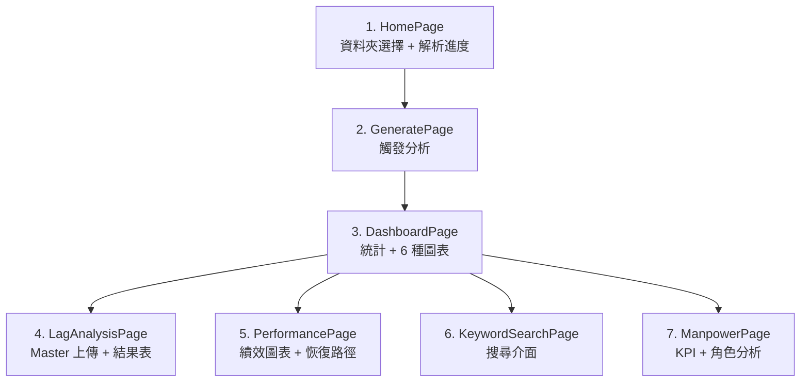
```mermaid
graph TD
    P1["1. HomePage<br/>資料夾選擇 + 解析進度"] --> P2["2. GeneratePage<br/>觸發分析"]
    P2 --> P3["3. DashboardPage<br/>統計 + 6 種圖表"]
    P3 --> P4["4. LagAnalysisPage<br/>Master 上傳 + 結果表"]
    P3 --> P5["5. PerformancePage<br/>績效圖表 + 恢復路徑"]
    P3 --> P6["6. KeywordSearchPage<br/>搜尋介面"]
    P3 --> P7["7. ManpowerPage<br/>KPI + 角色分析"]
```

| 順序 | 頁面 | 主要元件 | API 端點 |
|------|------|----------|----------|
| 1 | HomePage | FolderPicker, ParseProgress | `/api/config`, `/api/parse/*` |
| 2 | GeneratePage | AnalyzeButton, ExcelUpload | `/api/dashboard/analyze`, `/api/dashboard/load-excel` |
| 3 | DashboardPage | StatsCards, 6 Charts, DataTable | `/api/dashboard/*` (12 端點) |
| 4 | LagAnalysisPage | FileUpload, ConfigEditor, ResultTable | `/api/lag/*` (6 端點) |
| 5 | PerformancePage | ProjectSelector, PerfChart, CumulativeChart | `/api/performance/*` (8 端點) |
| 6 | KeywordSearchPage | SearchInput, ResultList | `/api/keyword/search` |
| 7 | ManpowerPage | KPICards, RoleTable, TeamChart | `/api/manpower/*` (3 端點) |

### 3.5 Phase 3：Electron 整合（預計 10 天）

#### 3.5.1 Electron Shell 開發

| 步驟 | 任務 | 產出 |
|------|------|------|
| 3.1 | `electron/main.js` — BrowserWindow 建立 | 視窗管理 |
| 3.2 | `electron/sidecar.js` — Sidecar 管理器 | spawn/kill/health-poll |
| 3.3 | `electron/preload.js` — IPC 橋接 | `window.electronAPI` |
| 3.4 | 原生檔案對話框 | `dialog:openDirectory`, `dialog:openFile` |
| 3.5 | 載入畫面（等待 Sidecar 就緒） | Loading screen |
| 3.6 | 錯誤處理（Sidecar 啟動失敗） | 重試/退出對話框 |

#### 3.5.2 Sidecar 生命週期

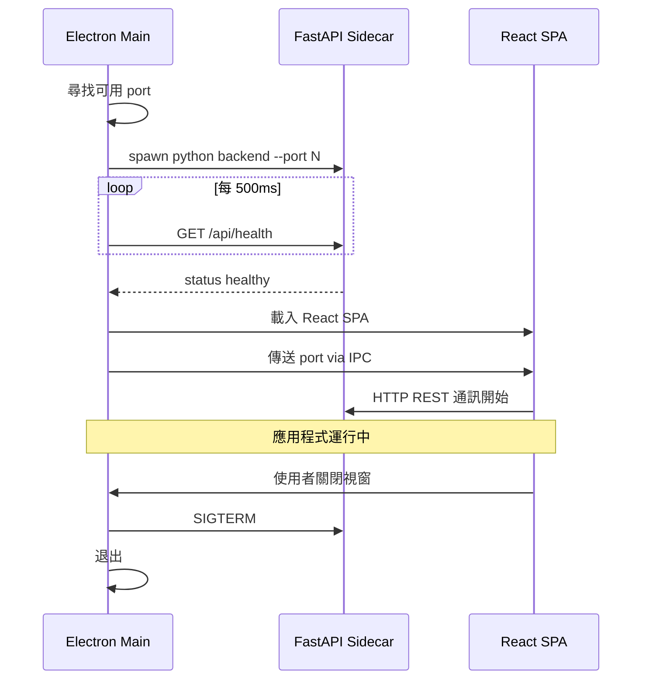
```mermaid
sequenceDiagram
    participant E as Electron Main
    participant S as FastAPI Sidecar
    participant R as React SPA

    E->>E: 尋找可用 port
    E->>S: spawn python backend --port N
    loop 每 500ms
        E->>S: GET /api/health
    end
    S-->>E: status healthy
    E->>R: 載入 React SPA
    E->>R: 傳送 port via IPC
    R->>S: HTTP REST 通訊開始

    Note over E,R: 應用程式運行中

    R->>E: 使用者關閉視窗
    E->>S: SIGTERM
    E->>E: 退出
```

### 3.6 Phase 4：打包與測試（預計 11 天）

#### 3.6.1 打包流程

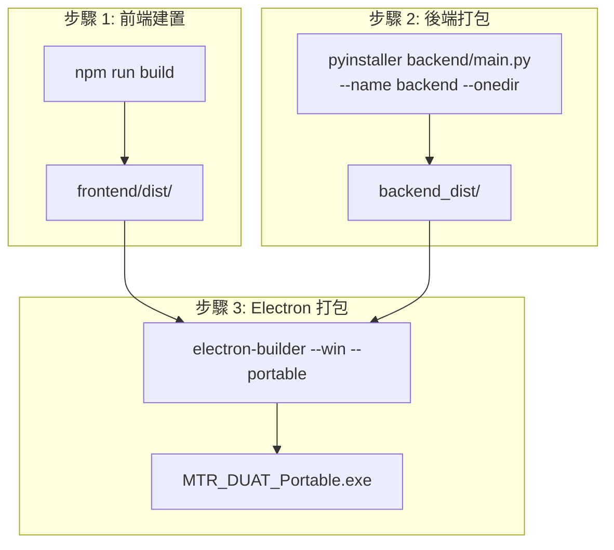
```mermaid
graph TD
    subgraph Step1["步驟 1: 前端建置"]
        V["npm run build"] --> Dist["frontend/dist/"]
    end

    subgraph Step2["步驟 2: 後端打包"]
        P["pyinstaller backend/main.py<br/>--name backend --onedir"] --> BD["backend_dist/"]
    end

    subgraph Step3["步驟 3: Electron 打包"]
        EB["electron-builder --win --portable"] --> EXE["MTR_DUAT_Portable.exe"]
    end

    Dist --> EB
    BD --> EB
```

electron-builder 配置要點：
```json
{
  "appId": "com.mtr.duat",
  "productName": "MTR DUAT",
  "win": {
    "target": "portable"
  },
  "portable": {
    "artifactName": "MTR_DUAT_${version}.exe"
  },
  "extraResources": [
    { "from": "backend_dist", "to": "backend" }
  ],
  "files": [
    "electron/**/*",
    "dist/**/*"
  ]
}
```

#### 3.6.2 可攜式 .exe 驗證清單

| 驗證項目 | 測試方法 |
|----------|----------|
| 無 Python 環境啟動 | 在乾淨 Windows VM 上執行 |
| 無 Node.js 環境啟動 | 在乾淨 Windows VM 上執行 |
| 從 USB 隨身碟執行 | 複製至 USB 後直接執行 |
| 從 SharePoint 同步資料夾讀取 DOCX | 指向 SharePoint 同步路徑 |
| 設定檔持久化 | 關閉後重開，驗證設定保留 |
| 多實例防護 | 同時啟動兩次，第二次應提示 |

---

## 4. 代碼審查 (Code Review)

### 4.1 現有程式碼品質評估

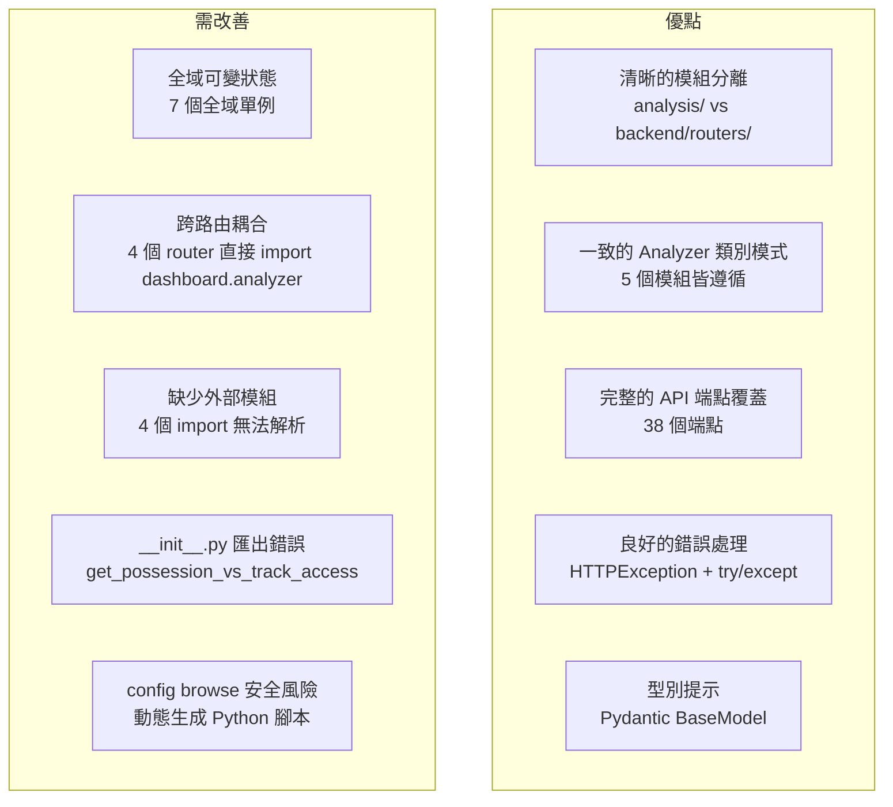
```mermaid
graph TD
    subgraph Good["優點"]
        G1["清晰的模組分離<br/>analysis/ vs backend/routers/"]
        G2["一致的 Analyzer 類別模式<br/>5 個模組皆遵循"]
        G3["完整的 API 端點覆蓋<br/>38 個端點"]
        G4["良好的錯誤處理<br/>HTTPException + try/except"]
        G5["型別提示<br/>Pydantic BaseModel"]
    end

    subgraph Issues["需改善"]
        I1["全域可變狀態<br/>7 個全域單例"]
        I2["跨路由耦合<br/>4 個 router 直接 import dashboard.analyzer"]
        I3["缺少外部模組<br/>4 個 import 無法解析"]
        I4["__init__.py 匯出錯誤<br/>get_possession_vs_track_access"]
        I5["config browse 安全風險<br/>動態生成 Python 腳本"]
    end
```

### 4.2 逐模組審查結果

#### 4.2.1 `analysis/dashboard.py` — 品質：良好

| 項目 | 評估 | 說明 |
|------|------|------|
| 函式大小 | 通過 | 所有函式 < 50 行 |
| 錯誤處理 | 通過 | try/except + logger |
| 型別提示 | 通過 | 完整的 type hints |
| 不可變性 | 部分 | `df.copy()` 使用正確，但 DashboardAnalyzer 內部狀態可變 |
| 測試覆蓋 | 缺失 | 無單元測試 |

發現問題：
- `get_monthly_trend` 中 Week 轉 Month 的近似公式 `((Week-1) // 4.33 + 1)` 在邊界情況可能不準確
- `get_weekly_trend` 硬編碼關鍵字列表 `['CBM', 'CM', 'PA work', 'HLM', 'Provide']`，應從 config 讀取

#### 4.2.2 `analysis/lag_analysis.py` — 品質：良好

| 項目 | 評估 | 說明 |
|------|------|------|
| 函式大小 | 通過 | `load_project_master` 較長（~70 行）但邏輯清晰 |
| 欄位映射 | 良好 | 不區分大小寫 + fallback 策略 |
| 核心公式 | 正確 | 線性插值邏輯正確 |
| 測試覆蓋 | 缺失 | 無單元測試 |

發現問題：
- `load_project_master` 中 `elif` 鏈過長，建議重構為映射表
- `_match_productivity` 硬編碼欄位名稱搜尋列表

#### 4.2.3 `analysis/performance.py` — 品質：良好

| 項目 | 評估 | 說明 |
|------|------|------|
| matplotlib 後端 | 正確 | 使用 `Agg` 非互動後端 |
| base64 輸出 | 正確 | 圖表正確編碼為 PNG |
| 記憶體管理 | 通過 | `plt.close(fig)` 正確釋放 |

#### 4.2.4 `analysis/scurve.py` — 品質：良好

發現問題：
- 週標籤生成假設每年 52 週，未處理 ISO 8601 中某些年份有 53 週的情況

#### 4.2.5 `analysis/manpower.py` — 品質：優良

| 項目 | 評估 | 說明 |
|------|------|------|
| 函式設計 | 優良 | 純函式 + 類別封裝雙層設計 |
| defaultdict 使用 | 正確 | 適當使用巢狀 defaultdict |
| Excel 匯出 | 完整 | 4 個 sheet + 格式化 |

#### 4.2.6 `backend/routers/config.py` — 品質：需改善

| 項目 | 評估 | 說明 |
|------|------|------|
| browse 端點 | 安全風險 | 動態生成 Python 腳本並以 subprocess 執行 |
| 路徑處理 | 風險 | `safe_path` 使用 f-string 插入腳本，可能有注入風險 |

建議：重建時移除 tkinter browse，改用 Electron 原生對話框。

#### 4.2.7 `backend/routers/dashboard.py` — 品質：良好

`convert_to_native` 遞迴序列化函式設計良好，正確處理所有 numpy/pandas 類型。

### 4.3 架構層面問題

| 問題 | 嚴重程度 | 建議 |
|------|----------|------|
| 全域可變單例（7 個） | 中 | 重建時考慮依賴注入或 FastAPI Depends |
| 跨路由直接 import | 中 | 使用共享服務層或事件匯流排 |
| 無測試覆蓋 | 高 | Phase 1 同步開發單元測試 |
| 無日誌標準化 | 低 | 統一使用 `logging` 模組 + 格式化 |
| 硬編碼關鍵字 | 低 | 從 config 讀取，支援使用者自訂 |

### 4.4 重建時保留 vs 重寫決策

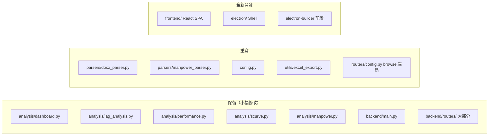
```mermaid
graph LR
    subgraph Keep["保留（小幅修改）"]
        K1["analysis/dashboard.py"]
        K2["analysis/lag_analysis.py"]
        K3["analysis/performance.py"]
        K4["analysis/scurve.py"]
        K5["analysis/manpower.py"]
        K6["backend/main.py"]
        K7["backend/routers/ 大部分"]
    end

    subgraph Rewrite["重寫"]
        R1["parsers/docx_parser.py"]
        R2["parsers/manpower_parser.py"]
        R3["config.py"]
        R4["utils/excel_export.py"]
        R5["routers/config.py browse 端點"]
    end

    subgraph New["全新開發"]
        N1["frontend/ React SPA"]
        N2["electron/ Shell"]
        N3["electron-builder 配置"]
    end
```

---

## 5. 測試計劃指南 (Test Plan Guide)

### 5.1 測試策略總覽

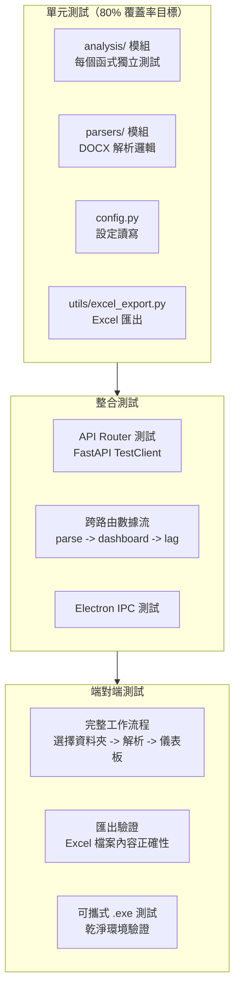
```mermaid
graph TD
    subgraph Unit["單元測試（80% 覆蓋率目標）"]
        U1["analysis/ 模組<br/>每個函式獨立測試"]
        U2["parsers/ 模組<br/>DOCX 解析邏輯"]
        U3["config.py<br/>設定讀寫"]
        U4["utils/excel_export.py<br/>Excel 匯出"]
    end

    subgraph Integration["整合測試"]
        I1["API Router 測試<br/>FastAPI TestClient"]
        I2["跨路由數據流<br/>parse -> dashboard -> lag"]
        I3["Electron IPC 測試"]
    end

    subgraph E2E["端對端測試"]
        E1["完整工作流程<br/>選擇資料夾 -> 解析 -> 儀表板"]
        E2["匯出驗證<br/>Excel 檔案內容正確性"]
        E3["可攜式 .exe 測試<br/>乾淨環境驗證"]
    end

    Unit --> Integration --> E2E
```

### 5.2 單元測試計劃

#### 5.2.1 analysis/ 模組測試

| 測試檔案 | 測試目標 | 測試案例數（預估） |
|----------|----------|-------------------|
| `test_dashboard.py` | aggregate_records, calculate_summary, trends, distributions | 15 |
| `test_lag_analysis.py` | get_status, load_project_master, calculate_nth_lag_lead | 12 |
| `test_performance.py` | calculate_performance_metrics, get_recovery_path | 10 |
| `test_scurve.py` | calculate_scurve_data, week label 生成 | 8 |
| `test_manpower.py` | headcount, team_dist, job_type, role_freq, work_access | 15 |

關鍵測試案例：

```python
# test_lag_analysis.py 範例
class TestGetStatus:
    def test_urgent(self):
        assert get_status(-15) == ("lag_urgent", "red")
    def test_behind(self):
        assert get_status(-7) == ("lag_behind", "orange")
    def test_slight_lag(self):
        assert get_status(-2) == ("lag_slight", "yellow")
    def test_on_track(self):
        assert get_status(3) == ("lag_on_track", "green")
    def test_ahead(self):
        assert get_status(10) == ("lag_ahead", "blue")
    def test_boundary_minus_10(self):
        assert get_status(-10) == ("lag_urgent", "red")
    def test_boundary_minus_5(self):
        assert get_status(-5) == ("lag_behind", "orange")
    def test_boundary_zero(self):
        assert get_status(0) == ("lag_slight", "yellow")  # < 0 不含 0
    def test_boundary_5(self):
        assert get_status(5) == ("lag_ahead", "blue")
```

#### 5.2.2 parsers/ 模組測試

| 測試案例 | 說明 |
|----------|------|
| 正常 DOCX 解析 | 使用測試用 DOCX 檔案驗證完整解析流程 |
| 藍色文字偵測 | 驗證 CBM/CM/PA work 等關鍵字正確識別 |
| 夜班零數量 | 驗證夜班藍色關鍵字產生 qty=0 |
| 鐵路線提取 | 驗證 10 條線代碼正確匹配 |
| 損壞檔案處理 | 驗證損壞 DOCX 不導致崩潰 |
| 空資料夾 | 驗證空資料夾回傳空列表 |
| `~$` 暫存檔排除 | 驗證暫存檔被正確跳過 |

#### 5.2.3 測試資料準備

```
tests/
├── fixtures/
│   ├── sample_daily_report.docx    # 正常報告（含藍色文字）
│   ├── sample_night_shift.docx     # 夜班報告
│   ├── sample_corrupted.docx       # 損壞檔案
│   ├── sample_project_master.xlsx  # Project Master
│   ├── sample_dashboard.xlsx       # 已匯出的儀表板
│   └── expected_outputs/           # 預期輸出 JSON
├── test_dashboard.py
├── test_lag_analysis.py
├── test_performance.py
├── test_scurve.py
├── test_manpower.py
├── test_docx_parser.py
├── test_manpower_parser.py
├── test_config.py
└── test_excel_export.py
```

### 5.3 整合測試計劃

| 測試場景 | 步驟 | 驗證 |
|----------|------|------|
| 完整解析流程 | parse/folder -> parse/progress -> parse/results | records 數量 > 0 |
| 儀表板分析 | dashboard/analyze -> dashboard/stats | stats 包含正確欄位 |
| 滯後分析流程 | lag/load-master -> lag/calculate -> lag/results | results 包含 Status |
| 績效分析流程 | performance/set-data -> performance/analyze | metrics 包含 success_rate |
| S-Curve 流程 | scurve/set-data -> scurve/calculate | 回傳 week_labels + data |
| 匯出流程 | export/dashboard | 回傳有效 Excel 檔案 |
| 人力分析流程 | manpower/scan -> manpower/analysis | kpis 包含 total_jobs |

### 5.4 端對端測試計劃

| 測試場景 | 前置條件 | 操作 | 預期結果 |
|----------|----------|------|----------|
| 首次啟動 | 乾淨環境 | 啟動 .exe | 顯示首頁，Sidecar 就緒 |
| 資料夾解析 | 有 DOCX 檔案 | 選擇資料夾 -> 解析 | 進度條 -> 完成通知 |
| 儀表板瀏覽 | 已解析數據 | 切換各圖表 | 圖表正確渲染 |
| Excel 匯出 | 已分析數據 | 點擊匯出 | 下載有效 Excel |
| 語言切換 | 任何頁面 | 切換中/英文 | 所有文字更新 |
| 設定持久化 | 已修改設定 | 關閉 -> 重開 | 設定保留 |
| 離線運作 | 斷開網路 | 所有功能 | 正常運作 |

### 5.5 測試執行命令

```bash
# 單元測試 + 覆蓋率
pytest tests/ --cov=analysis --cov=parsers --cov=config --cov=utils --cov-report=html

# 整合測試
pytest tests/integration/ -v

# 前端測試
cd frontend && npm run test

# 前端 E2E（Playwright）
cd frontend && npx playwright test
```

---

## 6. 演算法邏輯摘要 (Algorithm Logic)

本節摘要重建時必須保留的核心演算法。完整細節參見 [algorithm.md](algorithm.md)。

### 6.1 核心公式一覽

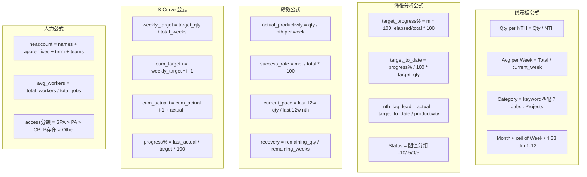
```mermaid
graph TD
    subgraph Dashboard["儀表板公式"]
        D1["Qty per NTH = Qty / NTH"]
        D2["Avg per Week = Total / current_week"]
        D3["Category = keyword匹配 ? Jobs : Projects"]
        D4["Month ≈ ceil of Week / 4.33 clip 1-12"]
    end

    subgraph Lag["滯後分析公式"]
        L1["target_progress% = min 100, elapsed/total * 100"]
        L2["target_to_date = progress% / 100 * target_qty"]
        L3["nth_lag_lead = actual - target_to_date / productivity"]
        L4["Status = 閾值分類 -10/-5/0/5"]
    end

    subgraph Perf["績效公式"]
        P1["actual_productivity = qty / nth per week"]
        P2["success_rate = met / total * 100"]
        P3["current_pace = last 12w qty / last 12w nth"]
        P4["recovery = remaining_qty / remaining_weeks"]
    end

    subgraph SCurve["S-Curve 公式"]
        S1["weekly_target = target_qty / total_weeks"]
        S2["cum_target i = weekly_target * i+1"]
        S3["cum_actual i = cum_actual i-1 + actual i"]
        S4["progress% = last_actual / target * 100"]
    end

    subgraph MP["人力公式"]
        M1["headcount = names + apprentices + term + teams"]
        M2["avg_workers = total_workers / total_jobs"]
        M3["access分類 = SPA > PA > CP_P存在 > Other"]
    end
```

### 6.2 重建時必須精確保留的邏輯

| 演算法 | 檔案 | 重要性 | 原因 |
|--------|------|--------|------|
| NTH Lag/Lead 線性插值 | `lag_analysis.py` | 關鍵 | 直接影響項目狀態判定 |
| 狀態閾值分類 | `lag_analysis.py:get_status` | 關鍵 | 5 級閾值不可更改 |
| 藍色文字偵測 | `docx_parser.py`（新） | 關鍵 | 決定工作類型識別 |
| S-Curve 累計計算 | `scurve.py` | 高 | 影響進度圖表準確性 |
| 績效 current_pace | `performance.py` | 高 | 12 週滑動窗口 |
| 人力 work_access 分類 | `manpower.py` | 中 | SPA > PA > Possession > Other 優先順序 |
| Project Master 欄位映射 | `lag_analysis.py` | 高 | 不區分大小寫 + fallback 策略 |

### 6.3 DOCX 解析器演算法（需新開發）

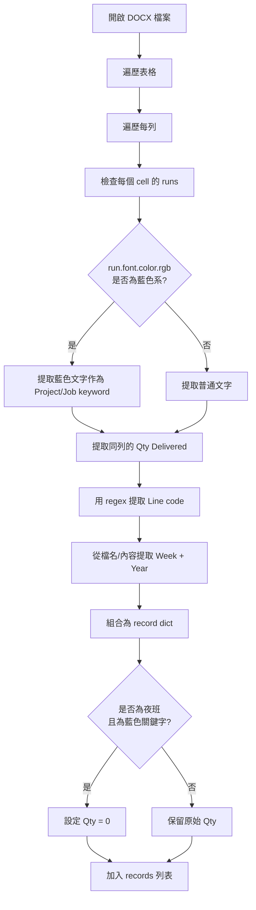
```mermaid
graph TD
    A["開啟 DOCX 檔案"] --> B["遍歷表格"]
    B --> C["遍歷每列"]
    C --> D["檢查每個 cell 的 runs"]
    D --> E{"run.font.color.rgb<br/>是否為藍色系?"}
    E -->|是| F["提取藍色文字作為 Project/Job keyword"]
    E -->|否| G["提取普通文字"]
    F --> H["提取同列的 Qty Delivered"]
    G --> H
    H --> I["用 regex 提取 Line code"]
    I --> J["從檔名/內容提取 Week + Year"]
    J --> K["組合為 record dict"]
    K --> L{"是否為夜班<br/>且為藍色關鍵字?"}
    L -->|是| M["設定 Qty = 0"]
    L -->|否| N["保留原始 Qty"]
    M --> O["加入 records 列表"]
    N --> O
```

---

## 7. 風險分析與緩解策略

### 7.1 風險矩陣

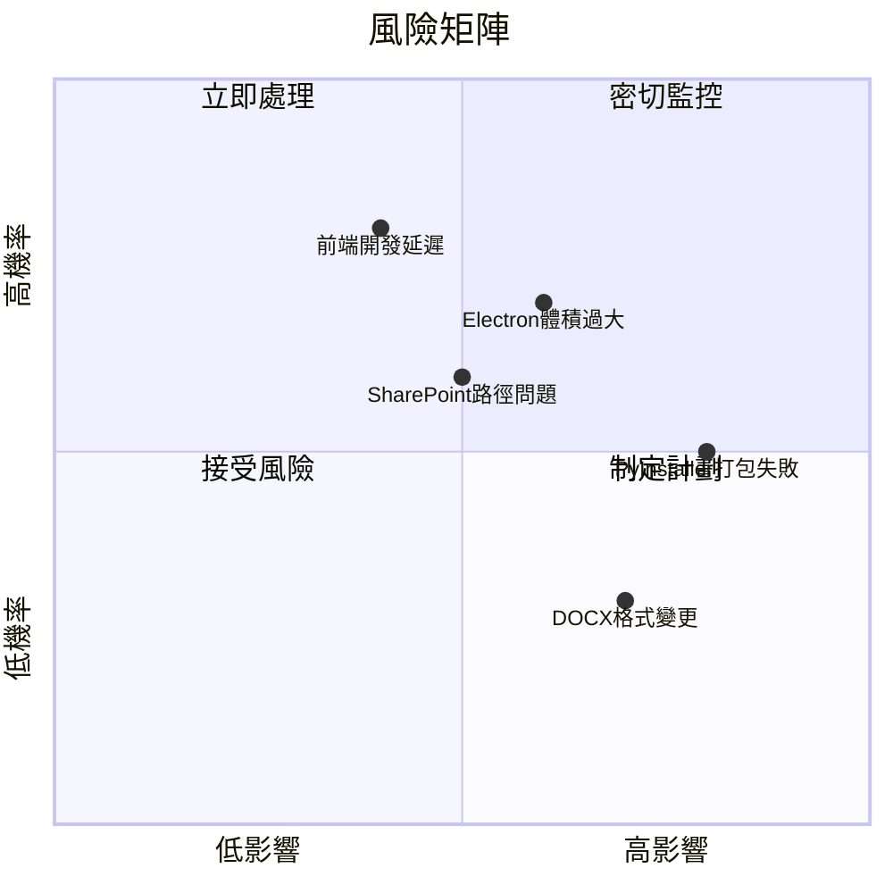
```mermaid
quadrantChart
    title 風險矩陣
    x-axis 低影響 --> 高影響
    y-axis 低機率 --> 高機率
    quadrant-1 密切監控
    quadrant-2 立即處理
    quadrant-3 接受風險
    quadrant-4 制定計劃
    DOCX格式變更: [0.7, 0.3]
    PyInstaller打包失敗: [0.8, 0.5]
    Electron體積過大: [0.6, 0.7]
    SharePoint路徑問題: [0.5, 0.6]
    前端開發延遲: [0.4, 0.8]
```

### 7.2 風險清單

| 風險 | 機率 | 影響 | 緩解策略 |
|------|------|------|----------|
| PyInstaller 打包失敗（缺少依賴） | 高 | 高 | 早期 Phase 0 驗證打包流程，建立 CI 自動打包 |
| Electron 可攜式 .exe 體積過大 | 高 | 中 | 使用 `--onedir` 而非 `--onefile`，壓縮資源 |
| SharePoint 同步路徑含空格/中文 | 中 | 中 | 所有路徑處理使用 `Path` 物件，測試中文路徑 |
| DOCX 格式變更導致解析失敗 | 低 | 高 | 解析器設計為容錯模式，記錄錯誤並繼續 |
| 前端從零開發延遲 | 高 | 中 | 優先開發核心頁面（Home + Dashboard），其餘迭代 |
| 企業防火牆阻擋 localhost 通訊 | 低 | 高 | 使用 `127.0.0.1` 而非 `localhost`，避免 DNS 解析 |
| 設定檔寫入權限不足 | 中 | 低 | Fallback 至 `%APPDATA%` 或唯讀模式 |

---

## 8. 里程碑與交付物


```mermaid
graph LR
    M0["M0: 腳手架完成<br/>專案結構 + 工具鏈"] --> M1["M1: 後端完善<br/>4 個外部模組 + 測試"]
    M1 --> M2["M2: 前端 MVP<br/>Home + Dashboard 頁面"]
    M2 --> M3["M3: 前端完整<br/>全部 7 個頁面"]
    M3 --> M4["M4: Electron 整合<br/>Sidecar + IPC"]
    M4 --> M5["M5: 可攜式 .exe<br/>打包 + 驗證"]
    M5 --> M6["M6: UAT 完成<br/>使用者驗收"]
```

| 里程碑 | 交付物 | 驗收標準 |
|--------|--------|----------|
| M0 | 專案腳手架 | `npm run dev` + `pytest` 可執行 |
| M1 | 後端完善 | 所有 38 個 API 端點可正常回應，單元測試 80%+ |
| M2 | 前端 MVP | Home + Dashboard 頁面可操作，圖表正確渲染 |
| M3 | 前端完整 | 全部 7 個頁面功能完整，i18n 中英文切換 |
| M4 | Electron 整合 | 桌面應用可啟動，Sidecar 自動管理 |
| M5 | 可攜式 .exe | 在乾淨 Windows VM 上成功執行 |
| M6 | UAT 完成 | 使用者確認所有功能符合需求 |

---

## 9. 開發環境設置指南

### 9.1 開發機器需求

| 項目 | 最低需求 | 建議配置 |
|------|----------|----------|
| 作業系統 | Windows 10 64-bit | Windows 11 64-bit |
| RAM | 8 GB | 16 GB |
| 磁碟空間 | 10 GB（含依賴） | 20 GB |
| Python | 3.12+ | 3.12.x |
| Node.js | 18.x LTS | 20.x LTS |
| npm | 9.x | 10.x |

### 9.2 開發工具鏈

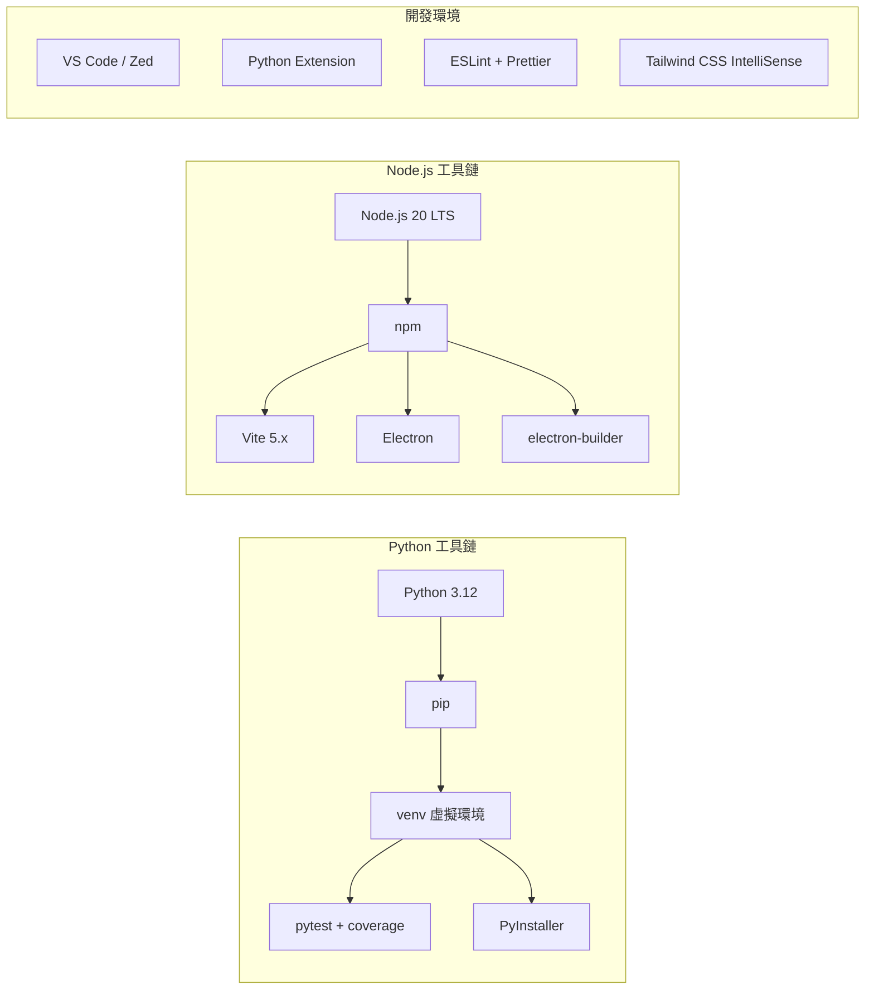
```mermaid
graph LR
    subgraph Python["Python 工具鏈"]
        PY["Python 3.12"] --> PIP["pip"]
        PIP --> VENV["venv 虛擬環境"]
        VENV --> PYTEST["pytest + coverage"]
        VENV --> PYINST["PyInstaller"]
    end

    subgraph Node["Node.js 工具鏈"]
        NODE["Node.js 20 LTS"] --> NPM["npm"]
        NPM --> VITE["Vite 5.x"]
        NPM --> ELECTRON["Electron"]
        NPM --> EBUILDER["electron-builder"]
    end

    subgraph IDE["開發環境"]
        VS["VS Code / Zed"]
        EXT1["Python Extension"]
        EXT2["ESLint + Prettier"]
        EXT3["Tailwind CSS IntelliSense"]
    end
```

### 9.3 環境初始化步驟

```bash
# 1. Clone 專案
git clone <repo-url> mtr_duat
cd mtr_duat

# 2. Python 虛擬環境
python -m venv .venv
.venv\Scripts\activate

# 3. 安裝 Python 依賴
pip install -r requirements.txt
pip install -r requirements-dev.txt

# 4. 前端依賴
cd frontend
npm install
cd ..

# 5. Electron 依賴（根目錄）
npm install

# 6. 驗證環境
pytest tests/ --co -q          # 列出測試（不執行）
cd frontend && npm run build   # 驗證前端建置
cd .. && python backend/main.py --port 8000  # 驗證後端啟動
```

### 9.4 開發模式啟動

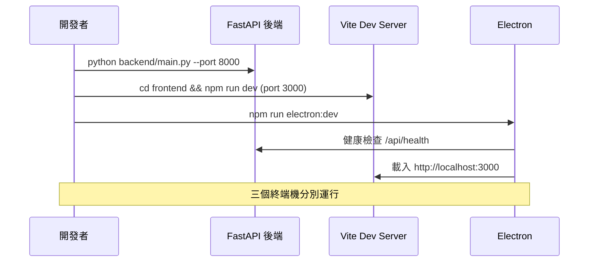
```mermaid
sequenceDiagram
    participant Dev as 開發者
    participant BE as FastAPI 後端
    participant FE as Vite Dev Server
    participant E as Electron

    Dev->>BE: python backend/main.py --port 8000
    Dev->>FE: cd frontend && npm run dev (port 3000)
    Dev->>E: npm run electron:dev
    E->>BE: 健康檢查 /api/health
    E->>FE: 載入 http://localhost:3000
    Note over Dev,E: 三個終端機分別運行
```

開發模式下三個進程獨立運行：
1. FastAPI 後端：`python backend/main.py --port 8000`（支援 hot reload）
2. Vite Dev Server：`cd frontend && npm run dev`（HMR 熱更新）
3. Electron Shell：`npm run electron:dev`（載入 Vite dev server URL）

### 9.5 環境變數

| 變數 | 用途 | 開發預設值 | 生產值 |
|------|------|-----------|--------|
| `DUAT_ENV` | 環境標識 | `development` | `production` |
| `DUAT_BACKEND_PORT` | 後端固定 port（開發用） | `8000` | 動態分配 |
| `DUAT_LOG_LEVEL` | 日誌級別 | `DEBUG` | `WARNING` |
| `DUAT_CONFIG_PATH` | 設定檔路徑覆寫 | `./mtr_duat_config.json` | 與 .exe 同目錄 |

---

## 10. 依賴管理策略

### 10.1 Python 依賴

#### 生產依賴 (`requirements.txt`)

| 套件 | 版本 | 用途 | 大小影響 |
|------|------|------|----------|
| fastapi | >=0.115 | REST API 框架 | 小 |
| uvicorn[standard] | >=0.30 | ASGI 伺服器 | 小 |
| pandas | >=2.2 | 數據處理 | 大（~50MB） |
| numpy | >=1.26 | 數值計算 | 大（~30MB） |
| python-docx | >=1.1 | DOCX 解析 | 小 |
| openpyxl | >=3.1 | Excel 讀寫 | 中 |
| matplotlib | >=3.9 | 圖表生成（後端） | 大（~40MB） |
| python-multipart | >=0.0.9 | 檔案上傳 | 小 |

#### 開發依賴 (`requirements-dev.txt`)

| 套件 | 用途 |
|------|------|
| pytest | 測試框架 |
| pytest-cov | 覆蓋率報告 |
| pytest-asyncio | 非同步測試 |
| httpx | FastAPI TestClient |
| pyinstaller | Python 打包 |
| ruff | Linter + Formatter |

### 10.2 前端依賴

#### 生產依賴 (`frontend/package.json`)

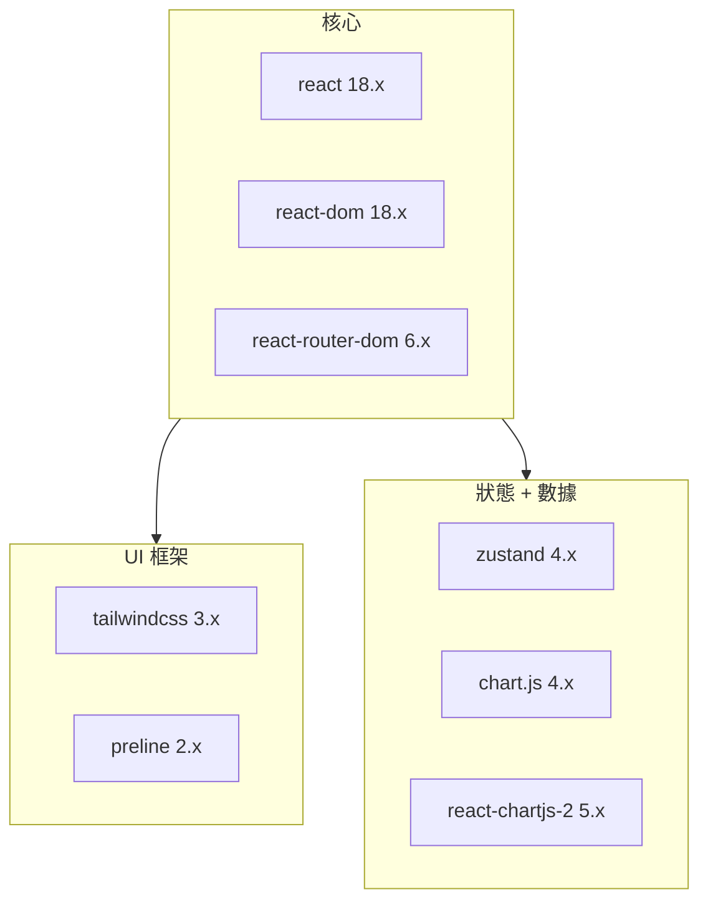
```mermaid
graph TD
    subgraph Core["核心"]
        React["react 18.x"]
        ReactDOM["react-dom 18.x"]
        Router["react-router-dom 6.x"]
    end

    subgraph UI["UI 框架"]
        TW["tailwindcss 3.x"]
        Preline["preline 2.x"]
    end

    subgraph State["狀態 + 數據"]
        Zustand["zustand 4.x"]
        ChartJS["chart.js 4.x"]
        ReactChart["react-chartjs-2 5.x"]
    end

    Core --> UI
    Core --> State
```

| 套件 | 版本 | 用途 |
|------|------|------|
| react | ^18.3 | UI 框架 |
| react-dom | ^18.3 | DOM 渲染 |
| react-router-dom | ^6.26 | 客戶端路由 |
| zustand | ^4.5 | 狀態管理 |
| chart.js | ^4.4 | 圖表庫 |
| react-chartjs-2 | ^5.2 | Chart.js React 封裝 |
| tailwindcss | ^3.4 | CSS 框架 |
| preline | ^2.4 | UI 元件庫 |

#### 開發依賴

| 套件 | 用途 |
|------|------|
| vite | 建置工具 |
| @vitejs/plugin-react | React 支援 |
| typescript | 型別檢查 |
| eslint + prettier | 程式碼品質 |
| @playwright/test | E2E 測試 |
| vitest | 單元測試 |

### 10.3 Electron 依賴

| 套件 | 版本 | 用途 |
|------|------|------|
| electron | ^33.x | 桌面外殼 |
| electron-builder | ^25.x | 打包工具 |

### 10.4 依賴鎖定策略

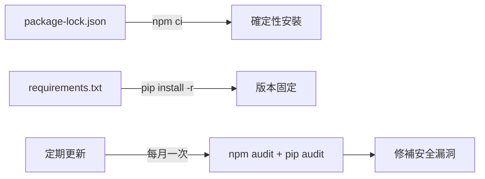
```mermaid
graph LR
    A["package-lock.json"] -->|"npm ci"| B["確定性安裝"]
    C["requirements.txt"] -->|"pip install -r"| D["版本固定"]
    E["定期更新"] -->|"每月一次"| F["npm audit + pip audit"]
    F --> G["修補安全漏洞"]
```

- Python：使用 `pip freeze > requirements.txt` 鎖定精確版本
- Node.js：使用 `package-lock.json` 確保確定性安裝
- 安全審計：每月執行 `npm audit` 和 `pip audit`
- 更新策略：patch 版本自動更新，minor/major 版本手動審查

### 10.5 PyInstaller 打包體積優化

| 策略 | 預估節省 | 說明 |
|------|----------|------|
| `--exclude-module tkinter` | ~15 MB | 重建後不再需要 tkinter |
| `--exclude-module test` | ~10 MB | 排除測試模組 |
| `--exclude-module unittest` | ~5 MB | 排除 unittest |
| matplotlib 後端限制 | ~20 MB | 僅保留 Agg 後端 |
| UPX 壓縮 | ~30% | 可選，可能影響啟動速度 |

預估最終 .exe 體積：150-200 MB（含 Python runtime + 所有依賴）

---

## 11. 技術債務清單

### 11.1 現有技術債務

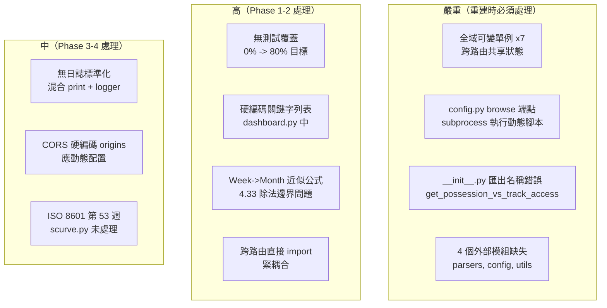
```mermaid
graph TD
    subgraph Critical["嚴重（重建時必須處理）"]
        TD1["全域可變單例 x7<br/>跨路由共享狀態"]
        TD2["config.py browse 端點<br/>subprocess 執行動態腳本"]
        TD3["__init__.py 匯出名稱錯誤<br/>get_possession_vs_track_access"]
        TD4["4 個外部模組缺失<br/>parsers, config, utils"]
    end

    subgraph High["高（Phase 1-2 處理）"]
        TD5["無測試覆蓋<br/>0% -> 80% 目標"]
        TD6["硬編碼關鍵字列表<br/>dashboard.py 中"]
        TD7["Week->Month 近似公式<br/>4.33 除法邊界問題"]
        TD8["跨路由直接 import<br/>緊耦合"]
    end

    subgraph Medium["中（Phase 3-4 處理）"]
        TD9["無日誌標準化<br/>混合 print + logger"]
        TD10["CORS 硬編碼 origins<br/>應動態配置"]
        TD11["ISO 8601 第 53 週<br/>scurve.py 未處理"]
    end
```

### 11.2 技術債務處理計劃

| ID | 債務 | 嚴重程度 | 處理階段 | 處理方式 |
|----|------|----------|----------|----------|
| TD-1 | 全域可變單例 | 嚴重 | Phase 1 | 引入 FastAPI `Depends` 依賴注入 |
| TD-2 | config browse 安全風險 | 嚴重 | Phase 3 | 移除 tkinter，改用 Electron IPC |
| TD-3 | `__init__.py` 匯出錯誤 | 嚴重 | Phase 0 | 修正為 `get_work_access_analysis` |
| TD-4 | 外部模組缺失 | 嚴重 | Phase 1 | 全新開發 4 個模組 |
| TD-5 | 無測試覆蓋 | 高 | Phase 0-1 | TDD 開發新模組，補寫現有模組測試 |
| TD-6 | 硬編碼關鍵字 | 高 | Phase 1 | 從 config 讀取，支援使用者自訂 |
| TD-7 | Week→Month 近似 | 高 | Phase 1 | 改用 `DateObj.dt.month` 精確計算 |
| TD-8 | 跨路由耦合 | 高 | Phase 1 | 引入共享服務層 |
| TD-9 | 日誌標準化 | 中 | Phase 2 | 統一 `logging` 模組 + JSON 格式 |
| TD-10 | CORS 硬編碼 | 中 | Phase 3 | 從環境變數或 config 讀取 |
| TD-11 | 第 53 週問題 | 中 | Phase 1 | 使用 `isocalendar()` 處理 |

### 11.3 重建時引入的新技術債務風險

| 風險 | 預防措施 |
|------|----------|
| React 元件過大 | 每個元件 < 200 行，提取子元件 |
| Zustand store 膨脹 | 按功能分割 slices |
| Electron IPC 過度使用 | 僅用於原生功能，數據走 HTTP |
| 前後端 API 契約不一致 | 使用 TypeScript 型別定義 + 整合測試 |
| 打包後路徑問題 | 統一使用 `path.join` + `app.getPath` |

---

## 12. 維護與支援計劃

### 12.1 版本管理策略

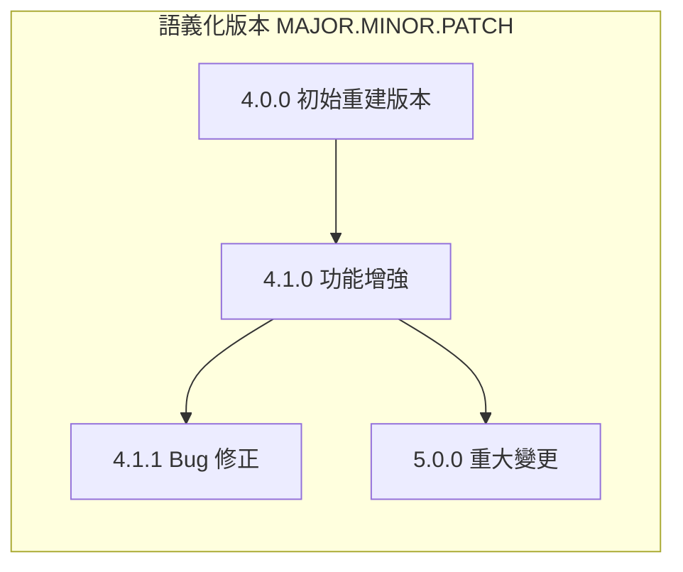
```mermaid
graph LR
    subgraph SemVer["語義化版本 MAJOR.MINOR.PATCH"]
        V1["4.0.0 初始重建版本"]
        V2["4.1.0 功能增強"]
        V3["4.1.1 Bug 修正"]
        V4["5.0.0 重大變更"]
    end

    V1 --> V2 --> V3
    V2 --> V4
```

| 版本類型 | 觸發條件 | 範例 |
|----------|----------|------|
| MAJOR | 架構變更、不相容 API 變更 | 4.0.0 → 5.0.0 |
| MINOR | 新功能、向後相容 | 4.0.0 → 4.1.0 |
| PATCH | Bug 修正、安全修補 | 4.0.0 → 4.0.1 |

### 12.2 發布流程

```mermaid
graph TD
    A["開發完成"] --> B["執行完整測試套件"]
    B --> C{"所有測試通過?"}
    C -->|否| D["修正問題"]
    D --> B
    C -->|是| E["更新版本號"]
    E --> F["建置可攜式 .exe"]
    F --> G["在乾淨 VM 上驗證"]
    G --> H{"驗證通過?"}
    H -->|否| D
    H -->|是| I["建立 Git Tag"]
    I --> J["上傳至 SharePoint 分發"]
    J --> K["通知使用者更新"]
```

### 12.3 DOCX 格式變更應對

```mermaid
graph TD
    A["偵測到解析失敗率上升"] --> B["收集失敗 DOCX 樣本"]
    B --> C["分析格式差異"]
    C --> D{"結構性變更?"}
    D -->|是| E["更新 parser 邏輯"]
    D -->|否| F["調整 regex / 容錯處理"]
    E --> G["新增測試案例"]
    F --> G
    G --> H["發布 PATCH 版本"]
```

由於 DOCX 報告格式可能隨業務需求變更，解析器設計原則：
1. 容錯優先 — 無法解析的列記錄警告並跳過，不中斷整體流程
2. 可配置關鍵字 — 工作類型關鍵字從 config 讀取，無需改程式碼
3. 測試驅動 — 每次格式變更新增對應測試 fixture

### 12.4 常見問題排查指南

| 問題 | 可能原因 | 排查步驟 |
|------|----------|----------|
| .exe 啟動後白屏 | Sidecar 啟動失敗 | 檢查同目錄下 `duat.log`，確認 port 未被佔用 |
| 解析結果為空 | DOCX 格式不匹配 | 確認檔名符合 `PS-OHLR_DUAT_Daily Report_*.docx` |
| 圖表不顯示 | Chart.js 數據為空 | 確認已執行「生成儀表板」步驟 |
| 設定未保存 | 寫入權限不足 | 確認 .exe 所在目錄有寫入權限 |
| Excel 匯出失敗 | 目標檔案被佔用 | 關閉已開啟的 Excel 檔案後重試 |
| 滯後分析無結果 | Project Master 欄位不匹配 | 確認 Excel 包含 Project No, Start Date, End Date, Target Qty 欄位 |
| 語言切換無效 | LocalStorage 損壞 | 清除瀏覽器快取（Electron DevTools → Application → Clear Storage） |

### 12.5 日誌與監控

```mermaid
graph LR
    subgraph Backend["後端日誌"]
        BL1["uvicorn.access — HTTP 請求"]
        BL2["duat.parser — 解析進度/錯誤"]
        BL3["duat.analysis — 分析計算"]
        BL4["duat.export — 匯出操作"]
    end

    subgraph Frontend["前端日誌"]
        FL1["console.error — API 錯誤"]
        FL2["console.warn — 數據異常"]
    end

    subgraph Electron["Electron 日誌"]
        EL1["main.log — Sidecar 生命週期"]
        EL2["renderer.log — IPC 通訊"]
    end

    Backend --> LogFile["duat.log<br/>與 .exe 同目錄"]
    Electron --> LogFile
```

日誌格式：
```
[YYYY-MM-DD HH:MM:SS] [LEVEL] [MODULE] message
```

日誌級別：
- `ERROR`：需要使用者注意的錯誤（解析失敗、匯出失敗）
- `WARNING`：可恢復的問題（設定檔損壞、欄位缺失）
- `INFO`：正常操作記錄（啟動、解析完成、匯出完成）
- `DEBUG`：開發除錯用（僅開發模式啟用）

---

## 13. 需求追溯矩陣

### 13.1 需求 → 模組 → 測試 追溯

```mermaid
graph LR
    subgraph Requirements["需求（18 項）"]
        R1["R1 Electron Shell"]
        R4["R4 DOCX 解析"]
        R6["R6 儀表板分析"]
        R7["R7 滯後分析"]
        R8["R8 績效分析"]
        R9["R9 S-Curve"]
        R14["R14 可攜式建置"]
    end

    subgraph Modules["實作模組"]
        M1["electron/main.js"]
        M2["parsers/docx_parser.py"]
        M3["analysis/dashboard.py"]
        M4["analysis/lag_analysis.py"]
        M5["analysis/performance.py"]
        M6["analysis/scurve.py"]
        M7["electron-builder config"]
    end

    subgraph Tests["測試"]
        T1["test_electron_lifecycle"]
        T2["test_docx_parser.py"]
        T3["test_dashboard.py"]
        T4["test_lag_analysis.py"]
        T5["test_performance.py"]
        T6["test_scurve.py"]
        T7["test_portable_exe"]
    end

    R1 --> M1 --> T1
    R4 --> M2 --> T2
    R6 --> M3 --> T3
    R7 --> M4 --> T4
    R8 --> M5 --> T5
    R9 --> M6 --> T6
    R14 --> M7 --> T7
```

### 13.2 完整追溯表

| 需求 ID | 需求名稱 | 實作模組 | 測試檔案 | 驗收標準數 |
|---------|----------|----------|----------|-----------|
| R1 | Electron Shell | `electron/main.js`, `electron/sidecar.js`, `electron/preload.js` | `test_electron_lifecycle` | 5 |
| R2 | FastAPI Sidecar | `backend/main.py` | `test_api_health.py` | 5 |
| R3 | React SPA | `frontend/src/pages/*.tsx` | `test_pages.spec.ts` | 5 |
| R4 | DOCX 解析 | `parsers/docx_parser.py` | `test_docx_parser.py` | 7 |
| R5 | 人力解析 | `parsers/manpower_parser.py` | `test_manpower_parser.py` | 5 |
| R6 | 儀表板分析 | `analysis/dashboard.py`, `routers/dashboard.py` | `test_dashboard.py` | 6 |
| R7 | 滯後分析 | `analysis/lag_analysis.py`, `routers/lag.py` | `test_lag_analysis.py` | 4 |
| R8 | 績效分析 | `analysis/performance.py`, `routers/performance.py` | `test_performance.py` | 3 |
| R9 | S-Curve | `analysis/scurve.py`, `routers/scurve.py` | `test_scurve.py` | 4 |
| R10 | 關鍵字搜尋 | `routers/keyword.py` | `test_keyword.py` | 4 |
| R11 | 人力分析 | `analysis/manpower.py`, `routers/manpower.py` | `test_manpower.py` | 5 |
| R12 | 國際化 | `frontend/src/lib/i18n.ts` | `test_i18n.spec.ts` | 4 |
| R13 | 設定持久化 | `config.py`, `routers/config.py` | `test_config.py` | 4 |
| R14 | 可攜式建置 | `electron-builder.yml`, `pyinstaller.spec` | `test_portable_exe` | 4 |
| R15 | 欄位映射文件 | `docs/field-mapping-spc.md` | 文件審查 | 4 |
| R16 | 技術設計文件 | `docs/design.md` | 文件審查 | 4 |
| R17 | PRD | `docs/prd.md` | 文件審查 | 4 |
| R18 | 架構文件 | `docs/architecture.md` | 文件審查 | 5 |

### 13.3 Epic → Phase 映射

| Epic | 名稱 | 優先級 | 實作階段 | 依賴 |
|------|------|--------|----------|------|
| E1 | Application Shell | P0 | Phase 3 | E2, E3 完成後整合 |
| E2 | DOCX 解析 | P0 | Phase 1 | Phase 0 腳手架 |
| E3 | 人力解析 | P0 | Phase 1 | Phase 0 腳手架 |
| E4 | 儀表板分析 | P0 | Phase 2 | E2 |
| E5 | 滯後分析 | P0 | Phase 2 | E4 |
| E6 | 績效追蹤 | P1 | Phase 2 | E4 |
| E7 | S-Curve | P1 | Phase 2 | E4 |
| E8 | 關鍵字搜尋 | P1 | Phase 2 | E2 |
| E9 | 人力分析 | P1 | Phase 2 | E3 |
| E10 | 國際化 | P1 | Phase 2 | E4 |
| E11 | 設定持久化 | P2 | Phase 1 | Phase 0 |
| E12 | 建置分發 | P2 | Phase 4 | 全部 |
| E13 | 文件 | P2 | 持續 | — |

---

## 14. 相關文件索引

| 文件 | 路徑 | 說明 |
|------|------|------|
| 系統架構 | [architecture.md](architecture.md) | 四層架構、通訊模式、API 目錄 |
| 演算法邏輯 | [algorithm.md](algorithm.md) | 每個函式的詳細演算法與流程圖 |
| 欄位映射 | [field-mapping-spc.md](field-mapping-spc.md) | 所有欄位定義、類型、公式 |
| 產品需求 | [prd.md](prd.md) | 13 個 Epic、使用者故事、驗收標準 |
| 技術設計 | [design.md](design.md) | 重建架構設計、元件介面、資料模型 |
| 需求規格 | [requirements.md](requirements.md) | 18 項功能需求 + 非功能需求 |
| 重建計劃 | [reconstruction-plan.md](reconstruction-plan.md) | 本文件 |
